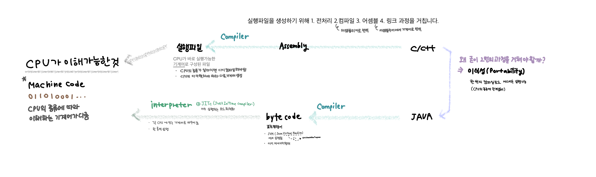

## 1.2 컴파일러는 어떻게 작동하는 것일까?

### 1.1 Recap

1.1장에서 배운 내용을 그림으로 복습해볼게요.

 

CPU는 스위치의 개폐(on/off)를 통해 0/1 만 이해할 수 있는 연산장치입니다. 따라서 CPU는 0과 1로만 구성된 기계어(Machine Code)를 이해할 수 있습니다. 이때 CPU의 아키텍처에 따라 다른 기계어를 사용합니다.  
대표적으로 많이 사용하는 컴파일 언어인 C/C++과 Java를 비교해보았습니다. 두 언어는 모두 컴파일 언어지만 다른 동작방식을 갖고 있습니다.

C/C++의 컴파일러는 하나의 실행파일을 생성(build)하기 위해 1.전처리 2.컴파일 3.어셈블 4.링크 작업을 진행합니다. 이 과정 중에 앞으로 이야기 할 대상파일(object file, `.o` )이 생성되기도 하고, 어셈블리어(Assembly)로 번역 되었다가 기계어로 다시 번역되기도 합니다. 어셈블리어는 CPU의 동작을 추상화하여 `mov`, `sub`, `add`와 같은 명령어로 구성된 저수준의 언어입니다.
이렇게 생성된 실행파일은 CPU가 바로 실행할 수 있는 기계어로 구성되어 있으며, 바이너리 코드입니다. 하지만 CPU의 종류에 따라 다른 기계어를 사용하므로 CPU의 종류가 변경된다면 다시 소스코드를 컴파일 해야 합니다.

이에 비해 Java는 컴파일러와 인터프리터를 함께 사용하고, 인터프리터를 통해 바로 코드를 실행합니다. Java 소스 코드는 컴파일러를 거쳐 'CPU의 기계 명령어의 표준 명령어 집합'으로 구성된 byte code를 생성합니다. 이 바이트 코드는 바이너리 형태의 기계어이므로 CPU 시뮬레이션 프로그램을 실행할 수 있습니다. 이 CPU 시뮬레이션 프로그램을 가상머신(virtual machine)이라고 부릅니다. 이 byte code를 인터프리터를 통해 각 CPU가 사용하는 기계어로 번역하여 한 줄씩 실행합니다. 경우에 따라 JITc(Just-In-Time compiler)를 사용하여 자주 실행되는 코드를 최적화하는 기법을 통해 성능을 개선하기도 합니다.

이렇게 프로그래밍 언어에서 CPU가 실행하는 과정에 대해 알아보았습니다.

 
 

### 1.2 컴파일러는 어떻게 작동하는 것일까?

이 책에서 설명하길 컴파일러는 고수준 언어를 저수준 언어로 번역하는 프로그램이라고 합니다. 
프로그래머가 작성한 인간이 인식할 수 있는 수준의 단어로 작성된 고수준 언어는 일반적인 텍스트 파일 형태로 저장되고 이를 소스파일 이라고 합니다. 
컴파일러는 텍스트 파일을 분석하는 텍스트 처리 프로그램일 뿐이라고 이야기하고 있습니다. 
그렇다면 실제로 컴파일러는 텍스트 처리를 어떻게 하고 있을까요?

 

 

우선 컴파일러는 텍스트 파일의 구문들을 잘게 쪼개어 토큰화합니다.   또한 토큰들을 수집, 평가하여 키워드값과 해당 토큰의 값을 저장해둡니다. 이를 Lexical analysis(어휘분석)이라 합니다.

토큰을 모두 수집했다면 토큰의 의도를 분석해야 합니다. 이를 Parsing(구문분석)이라 합니다. 
수집된 토큰의 의도를 분석하고, 다음에 어떤 토큰이 와야하는지 알고 있는 상태로 분석하기 때문에, 잘못된 토큰이 있다면 Syntax Error가 발생할 수 있습니다. 
파싱 과정을 거치면서 컴파일러는 구문을 분석하기 가장 좋은 방법인 추상구문트리(AST, Abstract Syntax Tree)를 만듭니다. 

추상 구문 트리를 만드는 동안 컴파일 오류가 발생하지 않았다면, 구문트리가 잘 만들어졌는지/구문트리에 이상은 없는지 확인하는 작업을 합니다.
이를 Semantic analysis(의미분석)이라 합니다.  
이 작업이 완료되면 컴파일 에러가 없다는 것이 증명됩니다.

컴파일 오류가 없는 경우, 완성된 구문트리를 탐색하며 중간코드(IR Code, Intermediate Representation Code)를 생성합니다. 
이는 토큰의 의도를 담은 결과가 됩니다.

마지막으로 컴파일러는 자신의 작업을 링커(linker)에게 위임하기 위한 작업을 진행합니다.  
우선 소스코드 파일을 링커가 기계어로 번역할 수 있도록 어셈블리어 코드로 변경합니다. (이후 어셈블 작업을 통해 기계어로 다시 번역하는 과정을 거치게 됩니다.)  
또한 링커가 원활하게 작업할 수 있도록 심볼테이블(symbol table)을 작성합니다.  
여기에서 심볼이란 모든 변수의 이름을 의미하는데, 링커는 오직 전역변수에만 관심이 있습니다. 
따라서 다른 모듈에서 참조 가능한 변수, 현재 모듈에서 참조해야 하는 외부 모듈의 변수에 대해서만 심볼테이블을 작성하게 됩니다. 
링커는 1. 각 대상 파일에서 참조하고 모든 외부 심볼이 잘 정의되어 있는지 2. 심볼의 정의가 단 하나만 존재하는지 확인합니다. 

 

### 1.3 엿보기

- 컴파일러는 프로그래머가 작성한 텍스트파일, 즉 소스코드를 분석하여 여러개로 구성된 소스코드 파일을 여러개의 대상파일로 만듭니다.
- 링커는 코드영역(기계 명렁어가 저장)/데이터영역(전역변수가 저장)/심볼테이블 로 구성된 목적파일 컴파일러로부터 전달 받습니다.
- 링커는 여러개의 대상파일을 심볼해석과 재배치를 통해 최종적으로 하나의 실행파일을 구성합니다.

