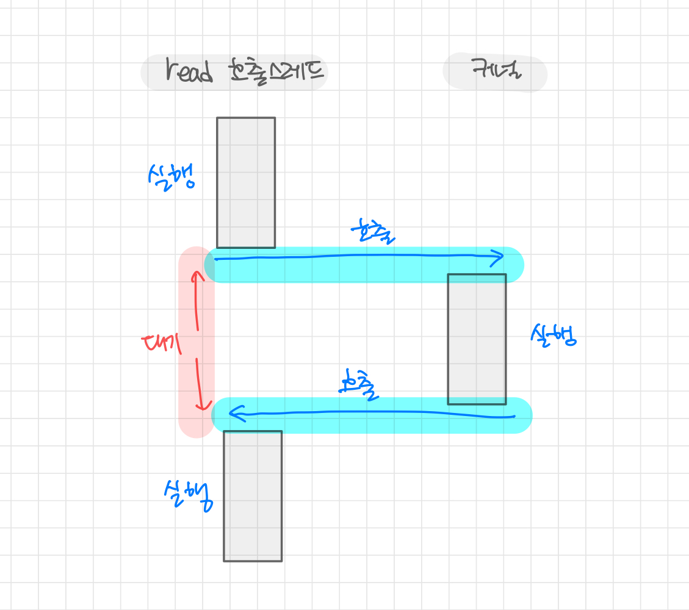
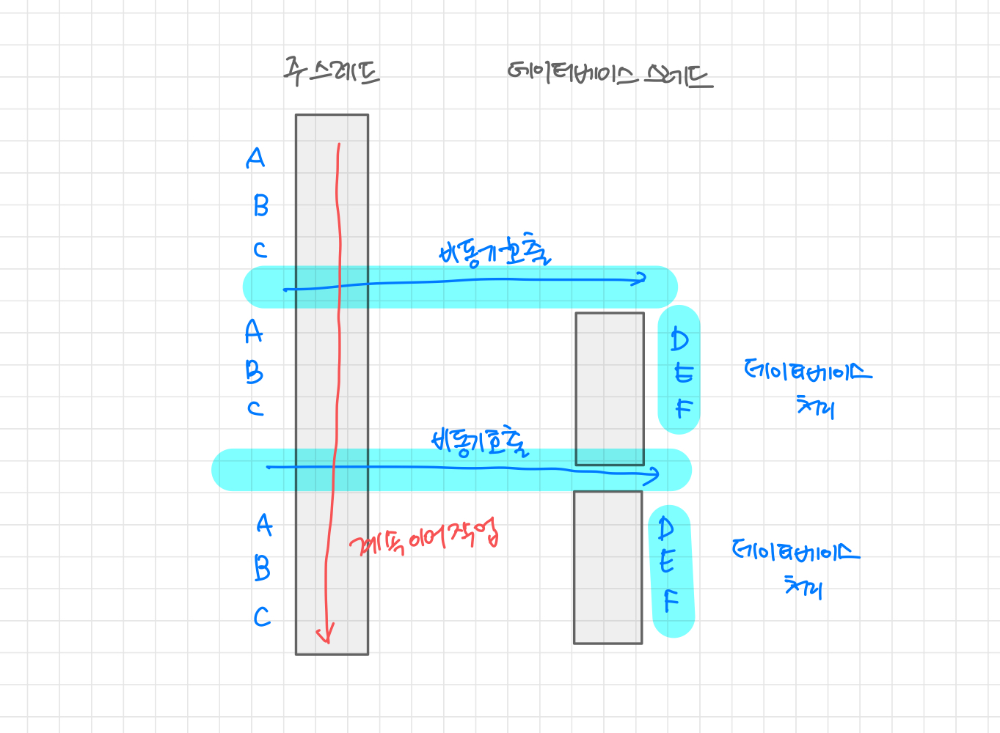
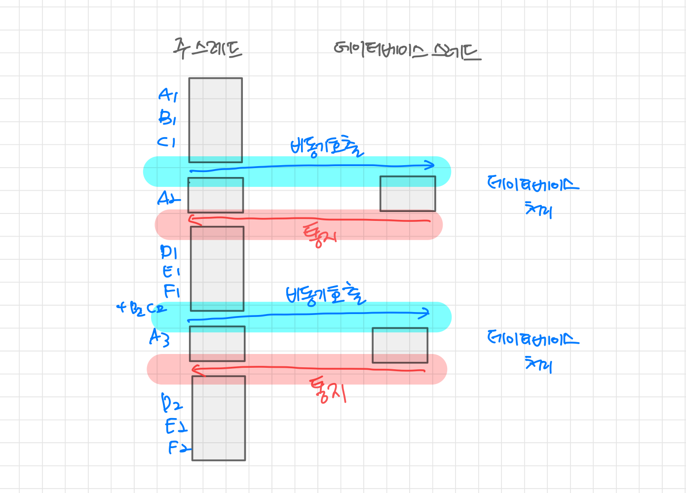

# 6. 동기와 비동기를 철저하게 이해한다.

## 1) 동기 호출

```cpp
funcA() {
  //함수 B가 완료될 때까지 기다린다.
  funcB();
  //함수 B는 프로세스를 반환하고 계속 진행한다.
}
```

위의 예시처럼 함수 A가 내부에 있는 함수 B를 호출하면 함수 B가 실행이 완료될 때까지 함수 A의 코드는 실행되지 않는다.<br />
무조건 <u>함수 B가 실행이 완료까지 기다리는 것을 "동기 호출"</u>이라 한다.

이런 동기 호출에서는 함수 A, B가 동일한 스레드에서 실행되는데 자주 볼 수 있는 상황이다.

<br />

### 특수한 상황인 입출력 작업에선 어떨까?

입출력 작업을 할 때 다음과 같이 read 함수를 호출해 파일을 읽는다고 가정해보자.

```cpp
read(file, but); // 여기에서 실행이 일시 중지된다.
```

해당 작업에서는 파일 읽기가 완료될 때까지 기다렸다가 계속 실행된다.

> 최하단 계층은 실제로 **시스템 호출(system call)로 운영 체제에 요청**을 보낸다.

1. 운영 체제는 파일 읽기 작업을 위해 호출 스레드를 일시 중지 시키고,
2. 커널이 디스크 내용을 읽어 오면,
3. 일시 중지되었던 스레드가 다시 깨어난다.

이것이 **블로킹 입출력(blocking input/output)** 이다.(동기 호출)

<br />

**블로킹 입출력(blocking input/output)**



따라서, 동기 호출은 요청 받은 작업이 끝날 때까지 기다려야 하기 때문에 호출자가 수신자가 같은 스레드에서 실행 중인지 여부와는 관계가 없다.

<br />

## 2) 비동기 호출

일반적인 비동기 호출은 디스크의 파일 읽고 쓰기, 네트워크 데이터 송수신, 데이터베이스 작업처럼 <u>**시간이 많이 걸리는 입출력 작업을 백그라운드 형태로 실행**</u> 한다.

### 파일을 읽는 read함수를 비동기로 호출할 수 있으면 어떨까?

예시처럼 이후 내용의 실행을 블로킹하지 않고 함수가 즉시 반환되어 다음 작업을 할 수 있는 것이 비동기 호출이다.

호출자의 이후 작업은 동시에 진행되기 때문에 높은 효율성을 가진다.

<br />

### 비동기 호출에서 작업이 언제 완료되었는지, 어떻게 처리되는지 알 수 있을까?

1. 호출자가 실행 결과를 신경쓰지 않을 때
2. 실행 결과를 반드시 알아야 할 때

이 두 가지 상황을 해결하기 위해 각 상황 별로 문제를 해결하는 방법을 알아보자.

<br />

### 호출자가 실행 결과를 신경쓰지 않을 때는?

콜백 함수를 사용해 read함수를 예로 든다면 비동기 호출 시에 파일 내용을 처리하는 함수를 함께 매개변수로 전달할 수 있다.

```cpp
void handler(void* buf) {
 ... // 파일 내용 처리중
}

read(buf, handler);
```

- "계속해서 파일을 읽고, 작업이 완료되면 전달될 함수를 사용하여 파일을 처리한다.
- 파일 내용은 호출자 스레드가 아닌 콜백 함수가 실행되는 다른 스레드 또는 프로세스 등에서 처리한다.

<br />

### 실행 결과를 반드시 알아야할 때는 어떨까?

알림(notification) 작동 방식을 사용한다.<br /> 작업 실행이 완료되면 **호출자에게 작업 완료를 알리는 신호나 메시지를 보내는 방법**이다.

결과 처리는 이전과 마찬가지로 호출 스레드에서 하고, 실제 작업은 일반적으로 다른 스레드에서 실행된다.

<br />
<br />

## 3) 웹 서버에서 동기와 비동기 작업

데이터베이스 작업을 예시로 보자.

일반적으로 웹 서버에는 주 스레드와 데이터베이스 처리 스레드라는 전형적인 스레드 두 개가 있다. 동기 방식을 먼저 접근해보자.

```cpp
main_thread()
{
    while(1)
    {
        // 요청 수신;
        A;
        B;
        C;
        // 데이터베이스 요청을 전송하고 결과가 반환될 때까지 대기;
        D;
        E;
        F;
        // 결과 반환;
    }
}

database_thread()
{
    while(1)
    {
        // 요청 수신;
        // 데이터베이스 처리;
        // 결과 반환;
    }
}
```

데이터베이스 요청 후 주스레드가 블로킹되어 일시 중지된다.<br />
그 후 데이터베이스 처리가 완료된 시점에서 이후 단계인 D, E, F가 계속 실행된다.

> 주 스레드 가운데는 "빈 공간"이 존재하며, 이 시간이 바로 주 스레드의 "유휴 시간(idle time)"이다.<br /> 이 유휴 시간 동안 데이터베이스 처리가 완료될 때까지 기다려야 다음 과정을 처리할 수 있다.

<br />

### 주 스레드의 유휴 시간을 해결하려면?

주 스레드가 데이터베이스 처리가 완료될 때까지 기다리는 대신, <br />
데이터베이스 처리 요청을 전송하자마자 바로 다음에 넘어온 새로운 요청을
<br />
직접 처리할 수 있는 "비동기 구현"을 사용하면 된다.

<br />

### (1) 주 스레드가 데이터베이스 처리 결과를 전혀 신경 쓰지 않을 때

**비동기 호출**



<br />

주 스레드는 데이터베이스 처리 완료 여부에 상관없다.
<br />
데이터베이스 처리가 완료된 후 주 스레드가 아닌 데이터베이스 스레드가 자체적으로 직접 처리한다.

> **이 상황에서 D, E, F 세 단계에 대한 작업 방법을 데이터 베이스 스레드가 어떻게 알 수 있을까?** <br />
> 콜백 함수를 사용해 주 스레드가 데이터베이스 처리 요청을 보낼 때 세 단계에 대한 작업 방법이 담긴 함수를 매개변수로 전달한다.

데이터베이스 스레드 입장에서는 자신의 주 업무인 데이터베이스를 처리하고 나서 콜백 함수를 호출하면 자신의 임무가 완료된 것이다.

> **호출자가 처리해야 할 작업은 사용자 요청에 따라 매우 다양할 땐?**<br />
> 호출자만 데이터베이스 결과를 처리하는 방법을 알고 있을 때는 <br />모든 작업들을 모두 콜백 함수에 담아 데이터베이스 스레드에 전달할 수 있다.

<br />

### (2) 주 스레드가 데이터베이스 작업 결과에 관심을 가질 때

데이터베이스 스레드는 알림 작동 방식을 이용하여 작업 결과를 주 스레드로 전송해야 한다.<br />
주 스레드는 메시지를 수신하면 이전 사용자 요청의 후반부를 계속 처리한다.



- 데이터베이스 스레드가 유휴 상태라는 점을 제외하면 주 스레드가 "유휴 시간"이 없다.
- 동기 호출에 비해 효율적이다.

> 물론, 모든 비동기 호출이 반드시 동기 호출보다 더 효율적이지 않기 때문에 구체적인 상황에 따라 분석해야 한다.

<br />
