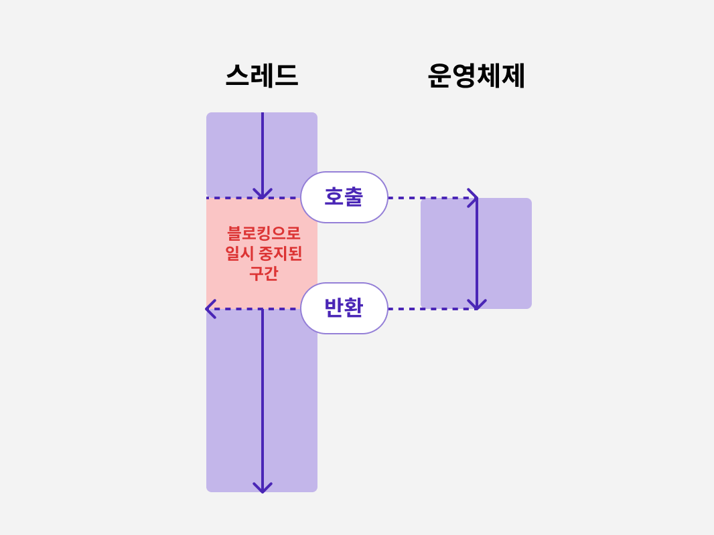

# 7. 아 맞다! 블로킹과 논블로킹도 있다

동기 또는 비동기를 이야기할 때 항상 두 가지 대상을 언급한다.

- 프로그래밍 : 서로 상호 작용하는 모듈 두 개 또는 함수
- 통신 : 두 통신 간 당사자

동기는 A, B라는 두 대상이 강하게 결합된 것으로 이런 의존 관계가 존재할 때 A와 B는 동기이다.<br />
A와 B가 강한 결합과 같은 제약이 없어 각자 자신의 작업을 실행할 수 있을 때 A와 B는 비동기이다.

> 🤔 "동기는 갓난아이와 부모의 관계처럼 강하게 의존되어야 하는 관계같고,<br /> 비동기는 마치 대학생이 된 출가한 아이와 부모의 관계처럼 독립적인 관계같다는 생각을 했다."

그리고, 동기와 비동기를 언급할 때는 반드시 양쪽을 모두 의미하며,
프로그래밍 영역에 국한되는 개념은 아니다.

<br />
<br />

## 1) 블로킹과 논블로킹

블로킹(blocking)과 논블로킹(non-blocking)은 프로그래밍에서 **함수를 호출할 때** 주로 사용한다.

> 함수 A와 B가 있다고 가정해보자.

함수 A가 함수 B를 호출할 때 함수 B를 호출함과 동시에<br />
운영 체제가 함수 A를 실행 중인 스레드나 프로세스를 일시 중지시킨다면<br />

함수 B에 대한 호출 방식은 <u>블로킹 방식</u>이고,<br />
아니라면 <u>논블로킹</u> 방식이다.



위의 이미지처럼 블로킹 방식이라면 블로킹으로 인해 스레드가 일시 중지된 모습을 볼 수 있다.(프로세스도 마찬가지)

그리고, 항상 함수 호출이 스레드나 프로세스가 운영 체제에 의해 일시 중지되지 않다는 것을 명심하자.

<br />

## 2) 블로킹의 핵심 문제: 입출력

일반적으로 블로킹은 대부분 입출력과 관련 있다.

디스크를 예로 들자면, 디스크가 하나의 트랙 탐색 입출력 요청을 완료하는 데 소요되는 시간은 ms 단위 수준이다.

반면 CPU의 클럭 주파수는 이미 GHz 단위 수준에 도달해 있기 때문에<br /> 디스크가 하나의 작업을 수행할 수 있는 ms 단위 시간이 CPU에 주어지면<br /> 대량의 기계 명령어 실행 작업을 수행할 수 있다.

<br />

### ms? GHz? 단위의 개념을 잠깐 알아보자!

> **ms 단위?** <br /> ms (밀리초, millisecond)는 1초의 1/1000(0.001초)를 의미하는 시간 단위. 즉, 1ms = 0.001초.

- 디스크(하드디스크, SSD 등)에서 데이터를 읽거나 쓰는 속도는 일반적으로 **ms 단위(밀리초 단위)** 로 측정된다.
- 예를 들어, 하드디스크(HDD)의 **탐색 시간(Seek Time)** 이 5ms라면, 하나의 데이터 요청을 처리하는 데 5밀리초가 걸린다.

> **GHz 단위?** <br /> <u>GHz (기가헤르츠, gigahertz)</u> 는 초당 몇 번의 연산을 수행할 수 있는지를 나타내는 단위로, <br /> 1GHz = <u>10⁹ Hz (10억 회 연산/초)</u> 를 의미합니다.

- CPU의 클럭 속도(Clock Speed)는 일반적으로 GHz 단위로 표현된다.
- 예를 들어, 3GHz CPU라면, 초당 30억(3 × 10⁹)번의 연산을 수행할 수 있다는 의미이다.

> **🔍 디스크와 CPU 속도의 차이** <br /> 디스크가 1ms 동안 데이터를 읽는 동안, CPU는 수억~수십억 개의 연산을 수행할 수 있음을 의미한다.<br /> 그래서, 스레드에서 입출력 과정이 실행되는 동안 CPU 제어권을 다른 스레드에 넘겨 다른 작업을 할 수 있도록 해야 한다.

<br />

### 블로킹 입출력 방식이 필요한 이유?

운영 체제는 CPU의 리소스를 최대한 활용할 수 있도록<br /> <u>**각 스레드 간에 CPU 사용 시간을 효율적으로 할당**</u> 해야 하기 때문이다.

운영 체제는 극효율을 추구하는 관리자 같은 역할이기 때문이 아닐까.

그 결과, 시간이 많이 걸리는 입출력 작업이 포함될 때 가끔 호출 스레드가 블로킹되며 일시 중지되는 일이 발생했고,<br /> 입출력 작업이 너무 느리다보니 관련 함수를 직접 호출하면 스레드 또는 프로세스가 블로킹되는 일이 생기는데

> **이를 해결하기 위해 논블로킹 호출을 사용하면,<br /> 호출 스레드가 중지되지 않고 입출력 작업을 시작할 수 있다!**

<br />
<br />

## 3) 논블로킹과 비동기 입출력

네트워크 데이터 수신을 예로 들어보자.

1. 데이터를 수신하는 함수가 논블로킹이면 이 함수를 호출할 때 운영 체제는 스레드를 일시 중지시키는 대신 해당 함수를 즉시 반환한다.
2. 호출 스레드는 자신의 작업을 계속 진행하며, 데이터 수신 작업은 커널이 처리한다.(병행 처리)

스레드 ↔ 운영 체제 사이에서 함수는 논블로킹으로 호출된다.

### 데이터를 언제 수신했는지 어떻게 알 수 있을까?

1. 논블로킹 방식 함수 외에 결과를 확인하는 함수를 함께 제공한다.

   - 해당 함수를 호출해 수신된 데이터를 확인한다.

2. 데이터가 수신되면 스레드에 메시지 / 신호 등 전송하는 알림 작동 방식을 사용한다.
3. 논블로킹 함수 호출 시, 데이터 수신 처리를 담당하는 함수를 콜백 함수에 담고, 매개변수로 전달한다.

   - 이때 논블로킹 함수는 콜백 함수를 지원해야 한다.

> 이런 방식을 논블로킹 호출이라 하며, 이런 유형의 입출력 작업을 비동기 입출력(asynchronous input/output)이라 한다. 호출이 블로킹 호출 방식에 비해는 직관적이지 않을 수 있다.

<br />
<br />

## 4) 피자 주문에 비유하기

사실 위의 개념까지는 잘 이해가 되지 않았는데 해당 비유로 조금 더 이해가 잘되어 같이 정리해두었다.

| 상황             | 방문 (블로킹 호출)                         | 전화 (논블로킹 호출)                        |
| ---------------- | ------------------------------------------ | ------------------------------------------- |
| **1. 주문 방법** | 직접 피자 가게에 가서 주문한다.            | 전화를 걸어 피자를 주문한다.                |
| **2. 대기 방법** | 피자가 완성될 때까지 가게 안에서 기다린다. | 다른 일을 하면서 피자가 올 때까지 기다린다. |
| **3. 피자 받기** | 피자가 완성되면 피자를 받고 가게를 나간다. | 피자가 오면 전화를 받는다.                  |

### 논블로킹 호출 상황에선 어떻게 피자가 완성된 지 알까?

| 인내심 수준                 | 방법                                                          |
| --------------------------- | ------------------------------------------------------------- |
| **매우 인내심이 강할 때**   | 그냥 다른 일을 하면서 기다린다. (피자, 주문자 모두 비동기)    |
| **인내심이 부족할 때**      | 5분마다 전화를 걸어 확인하면서 다른 일을 한다. (둘 다 비동기) |
| **매우 인내심이 부족할 때** | 5분마다 전화를 걸며 피자만 기다린다. (동기)                   |

<br />

> 무조건 논블로킹이 비동기만을 의미하진 않는다. <br /> 동기와 비동기, 블로킹과 논블로킹의 조합을 살펴보자!

<br />
<br />

## 5) 동기와 블로킹

동기와 블로킹은 비슷하지만,<br />
프로그래밍 관점에서보면 동기 호출은 반드시 블로킹이 아닌 반면에<br /> **블로킹 호출은 모두 확실한 동기 호출** 이다.

```javascript
function sum(a, b) {
  return a + b;
}

function funcA() {
  sum(1, 1);
}
```

- sum 함수에 대한 호출은 동기이다.
- funcA함수가 sum함수를 호출했다고 해서 블로킹되거나 스레드가 중단되지 않는다.
- 함수가 블로킹 방식으로 호출된 경우는 반드시 동기 호출이다.

<br />
<br />

## 6) 비동기와 논블로킹

### 네트워크 데이터 수신을 예를 봐보자.

데이터를 수신하는 recv함수를 논블로킹 호출로 설정하기 위해 `NON_BLOCKING_FLAG` 설정값(flag)를 추가하면,<br /> 다음과 같은 네트워크 데이터를 수신할 수 있다.

```cpp
void handler(void *buf) {
    // 수신된 네트워크 데이터 처리 로직
    ...
}

while (true) { // 계속해서 새로운 네트워크 연결을 기다리고 처리
    fd = accept();
    recv(fd, buf, NON_BLOCKING_FLAG, handler); // 호출 후 바로 반환, 논블로킹
}
```

- buf : 네트워크에서 받은 데이터(문자열, 숫자 등)
  - 이 데이터를 가공하거나 저장하는 역할
- accept : 네트워크 연결을 받는 함수
- recv : 네트워크에서 데이터를 받는 함수
  - fd : 연결된 클라이언트의 정보
  - buf : 데이터를 저장할 공간
  - NON_BLOCKING_FLAG : 논블로킹 모드를 설정하는 옵션
  - handler : 데이터를 다 받으면 실행할 함수

> 해당 코드에서 recv 함수는 논블로킹 호출이므로,<br /> 네트워크 데이터를 처리해주는 handler 함수를 recv함수에 콜백으로 전달한다.
> <br /> => 논블로킹 + 비동기

<br />

### 네트워크 데이터 도착을 감지하는 함수를 제공한다면?

```cpp
void handler(void *buf) {
    // 수신된 네트워크 데이터 처리 로직
    ...
}

while (true) { // 계속해서 새로운 네트워크 연결을 기다리고 처리
    fd = accept();
    recv(fd, buf, NON_BLOCKING_FLAG); // 호출 후 바로 반환, 논블로킹

    while (!check(fd)) {
        // 순환 감지
    }

    handler(buf);
}
```

- recv 함수는 동일하게 논블로킹으로 호출된다.
- while 반복문에서 끊임없이 감지를 시도하고 있어, 데이터가 도착하기 전까지는 handler 함수를 사용할 수 없다.

> 비록 논블로킹이지만 전체적인 관점에서 동기 코드이다.<br /> 해당 코드에서는 CPU 리소스가 반복문에 소요되 비효율적일 수 있다. <br /> 논블로킹이더라도 전체적으로 반드시 비동기는 아니며, 코드 구현 방식에 따라 달라질 수 있는 것.

<br />
