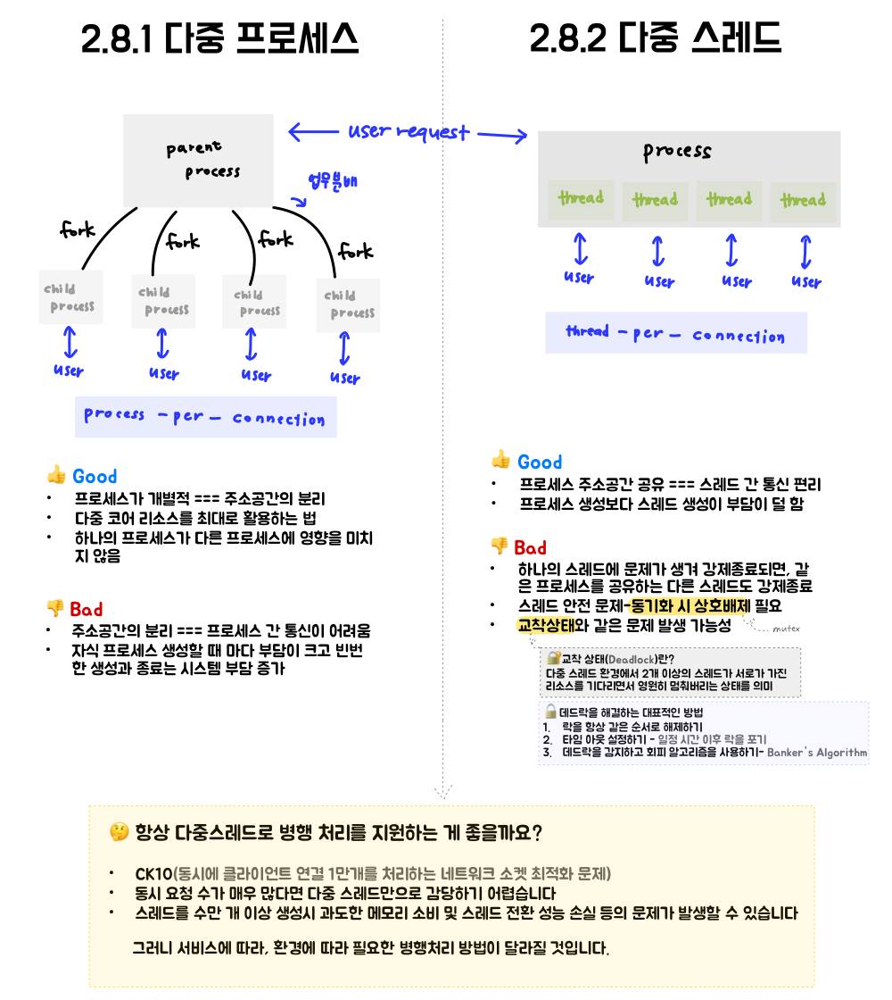

## 2.7 Recap

이 장에서는 블로킹과 논 블로킹에 대해 알아보았습니다.
<br>

두 개의 함수가 존재하고 (함수A와 함수B라 가정) A함수가 B함수를 호출할 때,<br>
A함수가 실행중인 스레드 또는 프로세스를 일시중지하고, B를 호출하게 된다면 이를 블로킹(Blocking)이라 합니다.<br>
반대로 스레드 또는 프로세스를 중지하지 않는다면 논 블로킹(Non-blokcing)호출이라 합니다.<br>

- 블로킹 호출 ⊂ 동기 호출 (동기 호출이지만 블로킹 호출이 아닌 것도 있습니다.)
- 논 블로킹 호출이라 해서 무조건 비동기를 의미하지 않습니다.

## 2.8 높은 동시성과 고성능을 갖춘 서버 구현

수천 개 부터 수만 개 까지의 사용자 요청을 동시에 처리해주는 서버의 비밀에 대해 알아봅시다.<br>
하나의 컴퓨터에 불과한 서버는 어떻게 모든 것을 처리하는 것이고, 어떤 기술을 필요로 할까요?<br>
지금까지 우리는 병행처리방식 2 가지를 배웠습니다.<br>

### 2.8.1 다중 프로세스 && 2.8.2 다중 스레드



병행처리 방식에는 다중 프로세스, 다중 스레드 말고도 이벤트 기반의 병행처리 방식이 존재합니다.<br>
이벤트 기반의 동시성(event-based concurrency)를 이용한 이벤트 기반 프로그래밍 방식(event-driven programming)입니다.<br>
이 방식은 서버프로그래밍과 GUI 프로그래밍에서 널리 사용됩니다.

### 2.8.3 이벤트 순환과 이벤트 구동

이벤트 순환과 이벤트 구동에는 아래 2가지 조건을 충족해야 합니다.

1. event: 서버에서는 입출력과 관계된 이벤트를 의미 (ex) 네트워크 수신 여부 및 파일의 읽기 쓰기 가능 여부
2. event handler: 이벤트를 처리하는 함수


이 이벤트 루프는 매우 간단해 보입니다. 하지만,<br>

- 어떻게 하면 `getEvent`함수 하나로 여러개의 이벤트를 가져올 수 있을까요?
  - ✅ 입출력 다중화로 해결
- 이벤트를 처리하는 핸들러는 반드시 이벤트 루프와 같은 스레드에서 실행되어야 하는 걸까요?
  - ✅ 반응자 패턴으로 해결

즉, 이벤트 타입이 달라도 함수 하나로 가져올 수 있어야 하고 <br>
핸들러와 이벤트 루프를 다른 스레드에서 실행될 수 있도록 하고 싶습니다. <br>
이에 대한 문제 해결책을 알아볼까요?

### 2.8.4 이벤트 소스와 입출력 다중화

여러개의 이벤트를 한번에 처리하고 싶습니다. 이를 위한 입출력 다중화 기술(input/output multiplexing)을 알아봅시다.<br>

리눅스와 유닉스 세계에서는 모든 것을 파일로 취급합니다.<br>
프로그램은 파일서술자(file descriptor)를 사용해 입출력 작업을 실행합니다.<br>
이를 여러개 처리하기 위해서는 어떻게 해결하면 될까요?<br>

우선 예시 코드의 이해를 돕기 위해 `recv()`함수에 대해 알아보겠습니다.

```c
ssize_t recv(int sockfd, void *buf, size_t len, int flags);

- sockfd: 수신할 소켓의 파일 서술자
- buf: 수신된 데이터를 저장할 버퍼
- len: 읽을 최대 byte 크기
- flags: 동작을 변경하는 옵션(default: 0)
```

사용자 연결이 10개, 소켓 서술자가 10개 있는 서버에서 데이터를 수신하려고 대기 중입니다.<br>
이를 처리하는 가장 간단한 방법은 아래와 같습니다.

```
recv(fd1, buf1);
recv(fd2, buf2);
recv(fd3, buf3);
...
```

`recv` 함수는 해당 소켓을 통해 데이터를 수신할 때 까지 대기하는 함수로,<br>수신할 소켓의 파일 서술자 fd1을 통해 데이터를 보내면 데이터를 buf1에 저장합니다.<br>
만약 이때, 첫번째 사용자가 데이터를 보내지 않는다면 `recv(fd1, buf1)` 코드가 반환되지 않으므로<br> 서버가 두 번째 사용자의 데이터를 수집하고 저장할 기회를 잃습니다.<br>

이를 해결하기 위해, 운영체제에게 다음과 같은 동작 방식을 전달하게 됩니다.<br>
**" 10개의 소켓 서술자를 감시하고 있다가, 데이터가 들어오면 알려주세요! "**<br>
이와 같은 방식을 입출력 다중화(input/output multiplexing)라 합니다.<br>
이에 대한 예시로 리눅스 `epoll`이 있습니다.


### 2.8.5 이벤트 순환과 다중스레드 && 2.8.6 반응자 패턴


### 2.8.7 이벤트 순환과 입출력

사용자 요청 처리 과정에서 입출력 작업도 포함된다면, 이벤트 루프에서는 어떻게 작업해야 좋을까요?


### 2.8.8 비동기와 콜백함수

서버 기능이 복잡해짐에 따라 용도에 따라 여러 부분으로 나뉘고 각각 별도의 서버에 배치됩니다.<br>
이때 여러 서버가 서로 조합하여 하나의 사용자 요청을 처리할 때, RPC(Remote Procedure Call, 원격 프로시져 호출)을 통해 호출합니다.<br>

이때에 RPC 호출을 **블로킹 호출**로 진행한다면, 사용자가 응답하기 전까지 함수가 반환되지 않습니다.<br>
따라서 **스레드가 일시 중지**될 수도 있습니다. 이는 CPU 리소스를 최대로 활용하지 못하게 됩니다.<br>

동기 방식의 **RPC 호출을 비동기 호출**로 수정하여 사용하게 되면,<br>
호출 스레드를 블로킹 하지 않으므로 함수가 즉시 반환되며, 스레드가 중지되지 않습니다.<br>
이때 처리할 내용을 콜백에 담아 RPC 호출에 포함시켜야 합니다.<br>

하지만 이러한 콜백함수를 담은 비동기 호출방식은 동기적 흐름의 코드와 다르게 직관적으로 파악하기 어렵습니다.<br>
코루틴을 통해 이러한 문제를 해결할 수 있습니다.

### 2.8.9 코루틴: 동기방식의 비동기 프로그래밍


- 🎯 스레드를 사용하는 블로킹 호출과 코루틴 호출의 차이점
  - 코루틴을 이용한 handler 코드 구현은 동기적 코드로 작성되지만 비동기 실행과 같은 효과
  - `yield`로 **CPU 제어권 반환**이 가능
  - 코루틴이 일시 중지 되더라도 **작업자 스레드가 블로킹 되지 않음**

### 2.8.9 CPU, thread, coroutine


- CPU (hardware)
  - 기계 명령어를 실행
- thread (커널 상태 스레드, kernel state thread)
  - 커널로 생성되고 스케줄링
  - 커널은 스레드 우선순위에 따라 CPU 연산 리소스를 할당
- coroutine (사용자 상태 스레드, user state thread)
  - 코루틴이 얼마나 많이 생성되었는지 커널은 알 수 없음
  - 커널은 코루틴과 관계 없이 스레드에 따라 CPU 시간을 할당
  - 프로그래머는 스레드에 할당된 시간 내 실행할 코루틴을 결정

