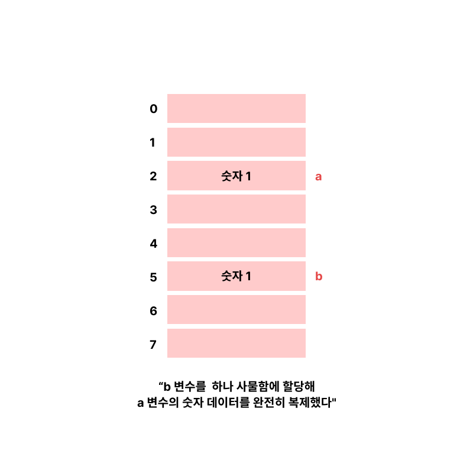
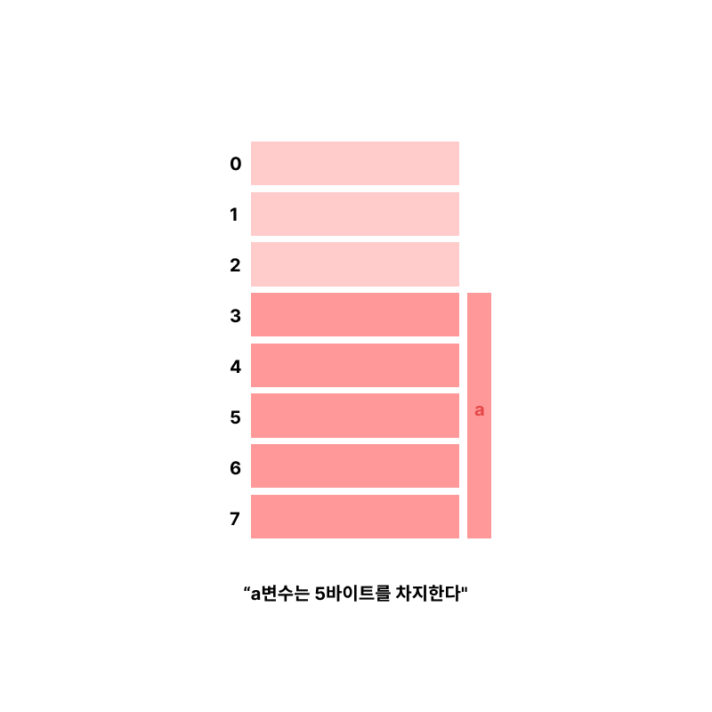
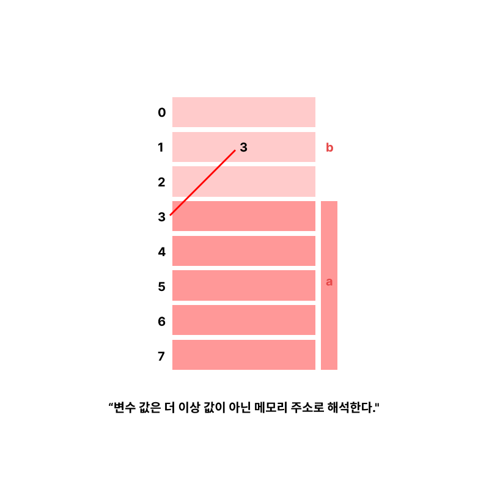

# 3.1 메모리의 본질, 포인터와 참조

## 1) 메모리의 본질은 무엇일까? 사물함, 비트, 바이트, 객체

메모리는 사물함에 비유할 수 있으며, 원리는 본질적으로 다르지 않다.
가장 작은 단위를 기준으로 본다면 사물함 형태의 구성과 비슷한데 메모리에서는 사물함 대신 메모리 셀(memory cell)이라는 표현을 사용한다.

<br />

### 1비트(bit)? 1바이트(byte)?

메모리 사물함(셀)에서는 여러 종류의 물건을 수납할 수 없고, <br />오로지 0과 1로만 보관할 수 있다. 이 보관되는 0 또는 1을 가르켜 1비트(bit)라 한다.

> 그래서 비트는 0아니면 1이다. <br />
> 그래서 대비되는 두 가지 정보만 표현할 수 있기에 비트만 사용하기에는 정보 표현에 한계가 있어 <br /> > <u>비트 8개를 묶어 정보를 나타내는 단위를 **1byte**로 사용한다.</u>

<br />

### 메모리 주소(memory address)? 주소 지정(addressing)?

각 바이트마다 번호를 붙이고, 모든 바이트는 메모리 내 가지고 있는 주소를 메모리 주소라 하며, <br /> 이 주소 한개를 사용해 특정한 사물함 여러 개를 찾을 수 있는 것을 주소 지정이라 한다.

<br />

### 바이트에 한계는 없을까?

**8비트**로 만들 수 있는 조합은 $2^8$ 인 256개에 불과하기 때문에
<br /> 부호 없는 정수로 표현하면 0부터 255까지의 숫자만 표현 가능하다.

더 많은 것을 표현하기 위해 **4바이트**는 32비트로 $2^{32}$ 개
<br /> 즉 4,294,967,296개의 조합이 가능해 더 많은 숫자 정보를 대응할 수 있다.

> 정수 표현 외에도 더 많은 정보를 표현하기 위해 12바이트를 <br />
> 이용해 정보를 조합하여 표시하는 것을 프로그래밍 언어에서는 구조체 또는 객체라고 표현한다.

<br />

### 부호 없는 정수(unsigned interger)?

**부호 없는 정수 (Unsigned Integer)** 는 “양의 정수만을 표현할 수 있는 정수”다.
즉, 0과 양의 정수만을 포함하고 음의 정수는 표현하지 않는 숫자다. 부호 없는 정수는 음수 값이 필요 없을 때 유용하게 사용된다.

- **부호 있는 정수(Signed Integer)** 는 양의 정수와 음의 정수 모두 표현 (예를 들어, 8비트 부호 있는 정수는 -128에서 +127까지의 값을 표현)
- **부호 없는 정수(Unsigned Integer)** 는 음의 정수를 표현하지 않고, 오직 0과 양의 정수만 표현 (8비트 부호 없는 정수는 0에서 +255까지의 값을 표현)

```js
// 부호 있는 8비트 정수 (표현 범위: -128에서 +127)
01111111(127);
10000000(-128);

// 부호 없는 8비트 정수 (표현 범위: 0에서 +255)
11111111(255);
00000000(0);
```

하지만, 메모리는 이런 데이터를 저장하는 단위에는 관심이 없다. 메모리 안에 저장되는 것은 0과 1일뿐이기 때문이다.

---

## 2) 메모리에서 변수로: 변수의 의미

메모리 읽기와 쓰기의 본질은 메모리는 사물함(셀)이라는 사실을 인지하고 있어야 한다는 것이다.
1byte를 저장할 수 있는 사물함 8개가 하나로 묶여 있고, 각각 하나의 번호가 붙어 있는데 이 번호를 메모리 주소라 한다.

<br />

### 이 상태에서 1 + 2값을 계산하고 싶다 가정하자.

1. 먼저 숫자 1과 숫자 2를 메모리에 저장한다. (CPU는 메모리에서 값을 읽어 레지스터에 저장해야 연산 수행이 가능하다.)

```cpp
store 1 6
```

> store 명령어로 저장을 하고, 숫자 두개 중 하나는 저장할 숫자 값(data value)을 의미하고 다른 하나는 사물함 번호, 즉 메모리 주소를 의미한다.

2. 쓰기에 대응하는 읽기를 위해 load 명령어를 사용한다.

```cpp
load r1 6
```

> 사용된 숫자는 값과 메모리 주소를 모두 나타낼 수 있기 때문에 해석이 모호해지는 문제가 있다.

- 두 숫자를 구분하기 위해 숫자 앞에 특별한 기호를 붙인다.
- $ 기호 사용 = 값, 기호가 없으면 메모리 주소를 의미한다.

```cpp
store $1 6
load r1 6
```

3. 숫자 1은 6번 사물함에 저장된다. (주소 6 -> 숫자 1)
4. 주소 별칭 "a" 변수를 사용해 변수가 대표하는 숫자를 저장한다.
   ( `=` a 변수가 나태내는 숫자 1이 메모리 주소 6에 저장되어 있다는 것을 나타낸다.)

> a 변수 또는 별칭 a는 두 가지 의미를 가진다.<br />
> (1) 값 1을 나타낸다. (2) 이 값은 메모리 주소 6에 저장된다.

<br />

### 변수를 다른 변수에 할당한다면?

```cpp
b = a
```



a값을 b에 준다는 할당을 메모리 관점에서 바라봐도 아래 이미지처럼 a변수의 숫자 데이터를 완전히 복제할 수 있다.



위의 이미지처럼 구조체나 객체처럼 여러 바이트를 차지하는 데이터가 a변수에 저장되어 있다면 변수 b의 값을 복사한다면 데이터만으로도 이미 10바이트를 차지할 때 어떻게 해야할까?

---

## 3) 변수에서 포인터로: 포인터 이해하기

변수의 메모리 공간과 관계없이 메모리 주소만 알고 있으면 해당 데이터를 찾을 수 있다. 메모리 주소 역시 하나의 숫자로 이 역시 데이터 공간 크기와는 무관하다.



위 그림처럼 b변수도 a변수를 가리키고 있다면 불필요한 데이터 복사본 필요 없이 주소를 저장해 메모리 주소로 해석하면 된다.

변수가 값뿐만 아니라 메모리 주소까지 저장할 수 있게 되면서 포인터가 탄생했다. 포인터를 주소 자체라고 언급할 때가 있지만 이는 어셈블리어 수준에서만 국한되는 이야기다.

> 고급 언어에서 포인터는 하나의 변수에 불과하고, 이 변수가 저장하기에 적합한 것이 메모리 주소일 뿐이다.

<br />

### 포인터는 메모리 주소를 더 높은 수준으로 추상화한 것이다!

```cpp
load r1 @1
```

위의 코드처럼 메모리 주소 1에 있는 값을 또 다른 메모리 주소로 해석하기를 원하기 때문에 1에 `@`과 같은 식별자를 추가해야 한다.

> 메모리 주소 1에 저장된 값 3을 읽어 해당 값을 메모리 주소로 간주해 해석한 후 메모리 주소 3이 가르키는 값을 진짜 데이터로 간주한다. ( = 이 값이 a 변수가 나타내는 값이다.)

**"주소1 -> 주소3 -> 데이터"** 로 지정하는 것을 <u>간접 주소 지정(indirect addressing)</u>이라고 한다.

<br />

### 고급 언어에서는 변수 개념을 사용한다.

고급 언어에는 변수 개념이 있는데 이때 메모리 주소 1이 가르키는 것은 b 변수이다. b 변수가 실제로 저장되는 위치는 중요하지 않다. (이중 포인터를 사용할 때 제외)

```cpp
주소 1 -> 주소 3 -> 데이터 // 어셈블리어 수준
b -> 데이터 // 고급언어 수준
```

> 포인터를 더 높은 수준의 추상화라고 일컫는 이유이자, 간접 주소 지정을 감싸기 위한 것이다.

<br />

### 이런 포인터의 장점은?

메모리 내부를 포인터를 이용해 조직화하고 프로그래머가 복잡한 데이터 구조를 직접 처리할 수 있게 해준다는 장점도 있다.

<br />

### 포인터의 개념은 언제 등장했을까?

PL/I언어에서 처음 등장했는데 연결 테이블(linked list) 처리 능력을 높이기 위해 등장했다.

1964년만 해도 연결 테이블을 다루는 게 어려웠기 때문이다. PL/I 언어에서 포인터의 위력을 발견해 C언에에서도 포인터 개념이 도입되었던 걸지도 모른다.

<br />

### PL / I 언어?

PL/I(Programming Language One)는 1960년대 IBM에서 개발한 프로그래밍 언어로, 과학 기술 계산과 비즈니스 데이터 처리의 기능을 통합하려는 목적으로 설계되었다.

---

## 4) 포인터의 힘과 파괴력: 능력과 책임

주소라는 개념은 변수로 추상화되어 있기 때문에 저장되는 것과는 상관없이 변수가 존재한다는 것만 알고 있으면 된다.

자바, 파이썬 언어와 다르게 C언어는 메모리 주소를 추상화하지 않아 더 유연하게 메모리 주소를 알 수 있다. (값과 메모리 주소 모두 저장 가능)

포인터 개념이 있으면 프로그래머는 메모리 같은 하드웨어를 직접 조작 가능한데 해당 변수가 메모리 어느 위치에 저장되어 있는지도 확인 가능하다.

---

## 5) 포인터에서 참조로: 메모리 주소 감추기

참조라는 개념을 제공하는 프로그래밍 언어에서 참조를 사용할 때는

- 변수의 구체적인 메모리 주소를 얻을 수 없다.
- 참조는 포인터와 유사한 구조의 산술 연산은 할 수 없다.
- 데이터를 복사할 필요 없이 포인터와 동일한 효과를 얻을 수 있다.

> 포인터는 메모리 주소를 추상화한 것이고 참조는 포인터를 한번 더 추상화한 것이다.

<br />
