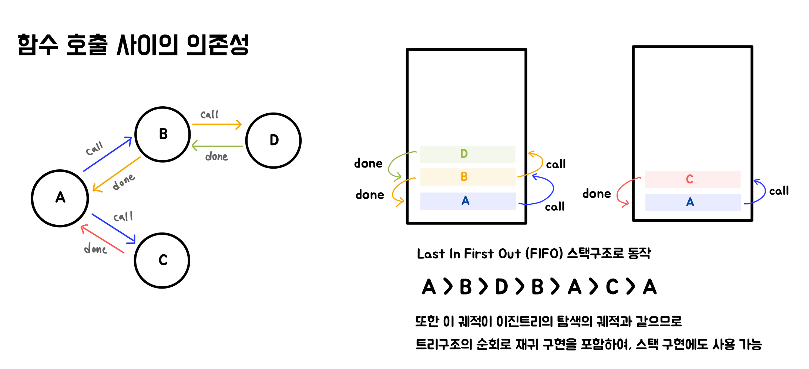
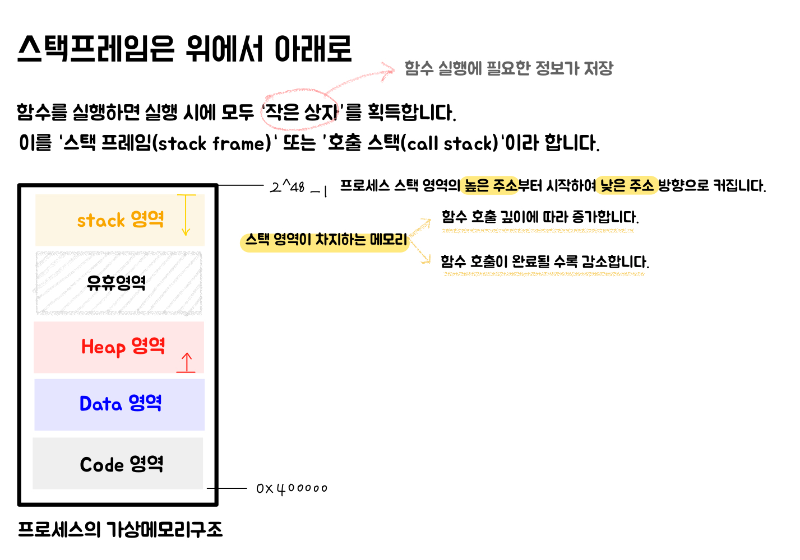
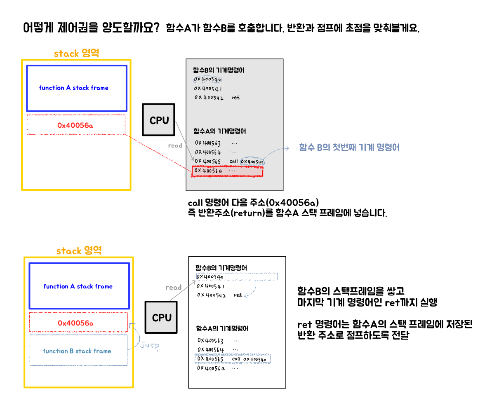
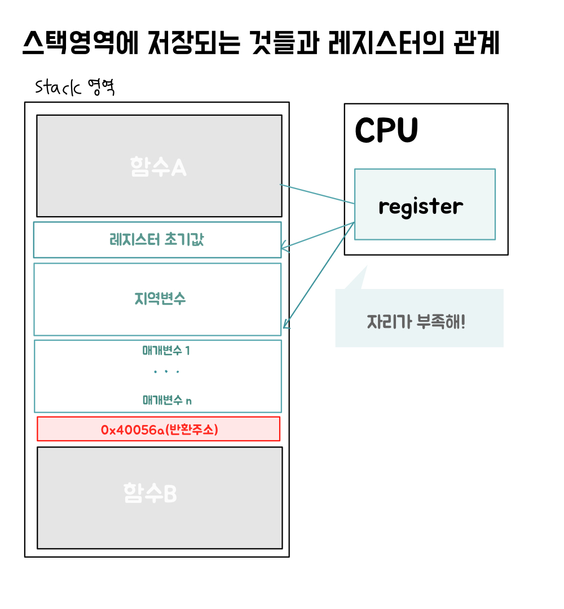

## 3.3 스택 영역: 함수 호출은 어떻게 구현될까?

아래의 코드에 대한 문제점을 발견할 수 있나요?

```c
void func(int a) {
  if (a > 100000000) {
    return;
  }

  int arr[100] = { 0 };

  func(a + 1);
}
```

우선 척 보기에는 실행에는 큰 문제가 없을 것처럼 보이는데요,<br>
그러나 메모리 관점에서 매우 치명적인 함수입니다. (사실 실행도 되지 않을 겁니다)<br>
<br>
`func(1);`을 호출했다고 가정해봅시다.<br>
스택영역에 `func(1)`이 쌓일 것이고 이 때 지역변수인 `arr`이 메모리에 할당될 것입니다. <br>
스택 메모리를 소비하게 되겠죠.<br>
<br>
`arr[100]`은 int의 크기가 4바이트라 가정하면 4 \* 100 = 400바이트가 소모됩니다.<br>
즉 `func`함수가 호출될 때 마다 400바이트의 메모리가 추가적으로 소모되고 있어요.<br>
이 외에도 매개변수, return 되는 값들의 주소 등을 고려한 스택프레임 크기는 조금 더 클겁니다.<br>
<br>
이어서 `func(2);`가 호출되며 `func1`은 종료되지 않은 상태로 `func2`스택이 쌓입니다.<br>
같은 동작을 하며 똑같이 종료되지 않은 상태로 `func3`을 호출하고... <br>
100,000,000(억) 단위까지 프레임을 쌓기도 전에 스택 메모리는 모두 사용될 것입니다.<br>
이것이 바로 스택 오버 플로우 (stack over flow)입니다. <br>
결국 재귀호출로 인한 스택오버플로우로 인해 이 함수는 실행되지 못하게 되겠죠.<br>

이렇게 척 보기에 문제 없어 보이는 코드도 스택 메모리 영역을 낭비하게 된다면 연산할 수 없습니다.<br>
따라서 함수를 작성할 때에는 메모리 친화적인 코드를 작성하는 것이 매우 중요합니다.<br>
스택 오버 플로우 에러를 만나지 않기 위해서요. 이를 위해 스택영역에 대해 알아봅시다.<br>

<br>

> **Tip**<br> > [Linux/maxOS 의 스택크기는 평균 8MB](https://unix.stackexchange.com/questions/127602/default-stack-size-for-pthreads/280865#280865) <br> > [Window 의 스택크기는 1MB](https://learn.microsoft.com/ko-kr/windows/win32/procthread/thread-stack-size)

<br>

### 3.3.1 프로그래머를 위한 도우미: 함수

- 함수는 기초적이고 간단한 코드 재사용 방식입니다.
- 함수 구현의 세부 사항을 감출 수 있게 하므로 함수를 호출할 때는 함수 이름, 매개변수, 반환값만 알면 됩니다. - 일종의 추상화

그렇다면 함수의 호출은 어떻게 구현되어 있을까요?

<br>

### 3.3.2 함수 호출 활동 추적하기: 스택

예시로 들어준 퀘스트를 코드로 표현해보겠습니다.

```js
function A() {
  console.log("start main Quest");

  const b = B();
  const c = C();

  console.log(`let's see B Result: ${b}`);
  console.log(`let's see C Result: ${c}`);

  console.log("main Quest done!");
}

function B() {
  console.log("start B Quest");

  const d = D();

  console.log(`Quest B done with D Result: ${d}`);

  return "B done";
}

function C() {
  console.log("start C Quest");

  return "C done";
}

function D() {
  console.log("start D Quest");

  return "D done";
}

A();
```

이를 출력해보면 다음과 같습니다.

```text
start main Quest
start B Quest
start D Quest
Quest B done with D Result: D done
start C Quest
let's see B Result: B done
let's see C Result: C done
main Quest done!
```

함수 호출관계성에 대해 아래와 같이 나타낼 수 있습니다.



함수 호출은 스택구조로 이루어진다는 것은 당연하다고 생각했는데,<br>
추가적으로 이진 트리 탐색으로 함수호출을 구현할 수 있다는 것도 확인할 수 있었습니다.<br>

<br>

### 3.3.3 스택 프레임 및 스택 영역: 거시적 관점

스택 프레임의 특징에 대해 살펴봅니다.



<br>

### 3.3.4 함수 점프와 반환은 어떻게 구현될까?

함수A가 함수B를 호출하면 **제어권**이 함수A에서 함수B로 넘어갑니다.<br>

- 제어권: 실제로 CPU가 **어떤 함수에 속하는 기계 명령어를 실행**하는지를 의미

제어권이 이전될 때는 두가지 정보가 필요합니다.

1. 반환(return): 어디에서 왔는지 > A함수의 기계 명령어가 어디까지 실행되었는지
2. 점프(jump): 어디로 가는지 > B함수의 첫 번째 기계 명령어가 위치한 주소

그렇다면 이 정보는 어떻게 획득하고 유지될까요? 바로 함수의 작은 저장소, 스택 프레임입니다.<br>
스택 프레임이 위에서 아래로 확장한다는 것을 기억하고 살펴볼게요.<br>



<br>

제어권 양도는 다음과 같이 실제 CPU가 읽는 기계어에 의해 이루어집니다.<br>
함수A의 첫 번째 기계어를 읽으며 스택 영역에 함수A 스택프레임을 쌓고,<br>
함수 B를 호출하는 과정에서 call 명령어 다음 주소를 스택프레임A의 하단에 추가합니다.<br>
함수B의 첫 번째 기계어를 읽으며 스택프레임B를 추가합니다.<br>
함수B의 마지막 기계어인 ret를 읽으면 다시 스택프레임A에 저장해두었던 장소(반환 장소)로 jump 합니다.<br>

<br>

### 3.3.5 매개변수 전달과 반환값은 어떻게 구현할까?

CPU는 기계 명령어를 실행할 때 점프와 반환이 가능하므로 함수를 호출할 수 있었습니다.<br>
그렇다면 함수를 호출할 때 함수 이름 말고도 매개변수와 반환값을 가져와야 합니다.<br>
이건 어떻게 구현될까요?

CPU에는 CPU용 메모리, 레지스터가 있습니다.<br>
따라서 매개변수를 전달하거나 반환값을 가져오는 작업을 레지스터를 통해 할 수 있습니다.<br>
하지만 CPU 내부의 레지스터 수는 제한되어 있으므로<br>
전달되는 매개변수 수가 사용 가능한 레지스터수보다 많다면 나머지 매개변수는 스택 프레임에서 가져와야 합니다.<br>

<br>

### 3.3.6 지역 변수는 어디에 있을까?

함수 외부에 정의된 변수는 전역 변수라 합니다.<br>
전역변 수는 실행 파일의 데이터 영역에 저장되어 있다가, 프로세스를 실행하면<br>
프로세스 주소 공간의 데이터 영역에 적재됩니다.<br>
그렇다면 함수가 실행될 때 필요한 지역변수는 어디에 있을까요?<br>

이들 역시 레지스터에 저장될 수 있지만, 로컬 변수가 레지스터 수 보다 많다면<br>
이들도 스택 프레임에 저장되어야 합니다.<br>

하다 못해 프로세스의 주소공간을 공유하는 것도 문제가 되는데,<br>
서로 다른 함수가 같은 레지스터를 공유한다면 문제가 되지 않을까요?<br>

그렇습니다. <br>
함수A가 함수B를 호출할 때 함수A가 레지스터에 기록한 지역 변수 정보를 함수B가 덮어쓸 수 있기 때문에 <br>레지스터 초기값을 저장해야 합니다.

<br>

### 3.3.7 레지스터의 저장과 복원

레지스터에 지역 변수를 저장하기 전, <br>
반드시 레지스터에 원래 저장되어 있던 초기값들을 꺼내어 함수 스택 프레임에 저장되어야 합니다.<br>
함수 실행이 완료되면 스택 프레임에 저장되어 있는 초기값들을 꺼내어 레지스터를 복원해주어야 합니다.<br>



<br>

### 3.3.8 큰 그림을 그려보자, 우리는 지금 어디에 있을까?

그럼 지금까지 프로세스의 가상 메모리 공간 중 스택영역에 대해 알아보았습니다.<br>
스택 영역을 공부하고 나니 앞서 제시한 문제에 대한 답이 명확히 제시되었습니다.<br>

바로 스택 넘침(stack overflow)에 대한 답을 말이죠! 그럼 이에 대한 해결책도 말해 볼 수 있겠네요.<br>

- 너무 큰 지역변수는 지양할 것 > 전역에 선언할 수 있다면 전역 변수로 선언할 것
- 함수 호출단계가 너무 많은 것은 지양할 것

<br>

스택 영역 아래에는 유휴 공간이 존재합니다.<br>
스택 영역이 증가하면 유휴 영역을 점유하기 시작하는데, <br>
아무것도 없을 것이라 생각하는 이 유휴 공간에는 사실 동적 라이브러리가 적재됩니다.<br>
이 유휴 공간(free segment)의 아래에는 힙 영역이 존재하죠. 다음주엔 힙 영역에 대해 알아봅시다 :)

<br>

### 저자가 남긴 퀴즈와 조사해 볼 만한 것

- 매개변수가 너무 많으면 레지스터에 저장하다가 일부는 스택 프레임에 저장된다고 했습니다. 그럼 레지스터에 모두 저장되지 못했다는 정보는 어떻게 알 수 있을까요?
- 스택 영역의 증가와 감소는 어떻게 구현될까요?
- 유휴영역에 동적 라이브러리는 어떻게 적재될까요?

이에 대한 답은 제가 다음주에 천천히 조사하여 적어볼까 합니다. 조금만 기다려주세요!
