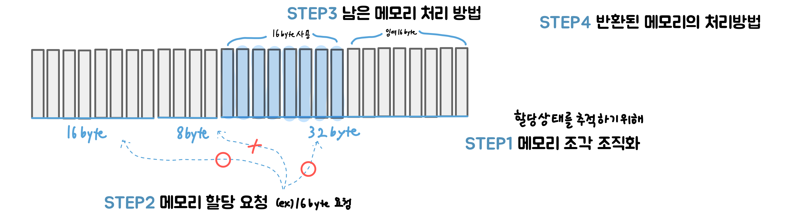
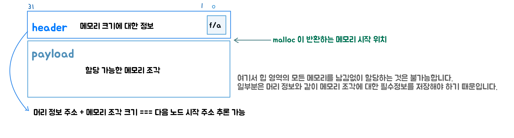
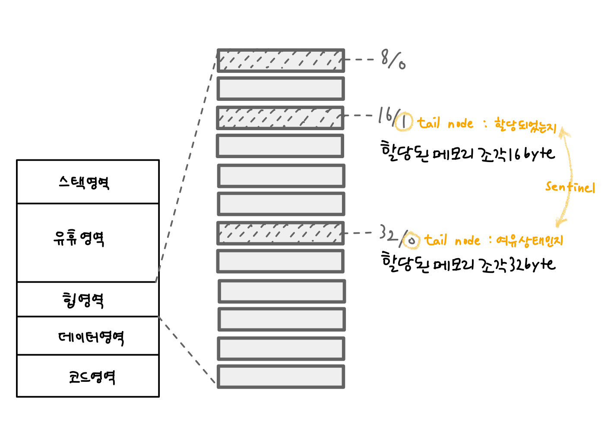
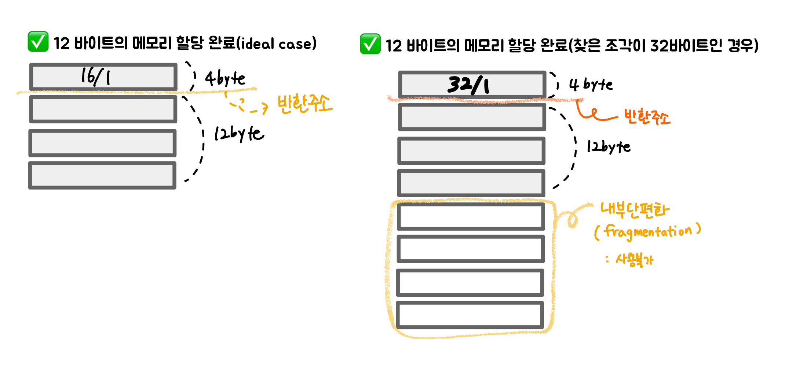
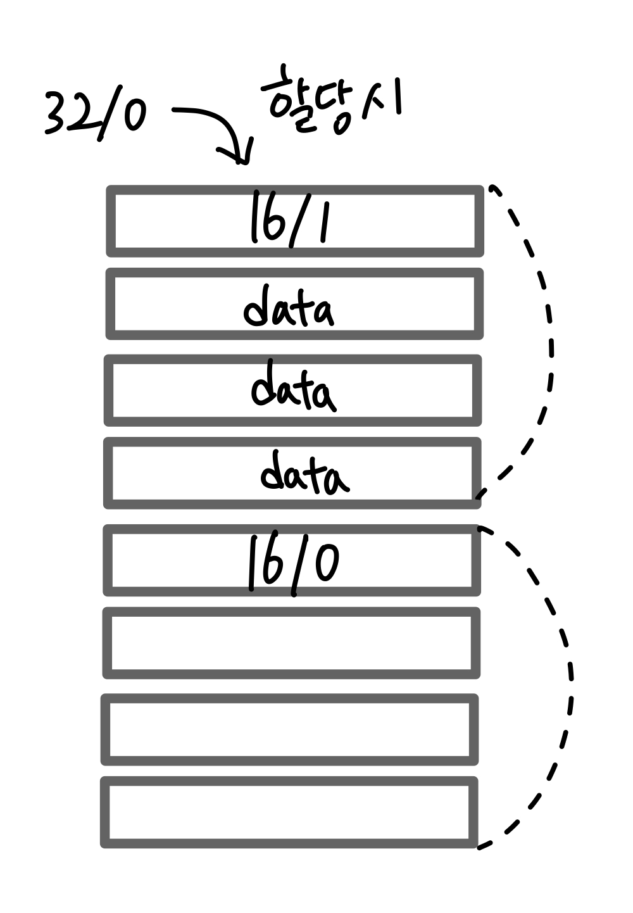
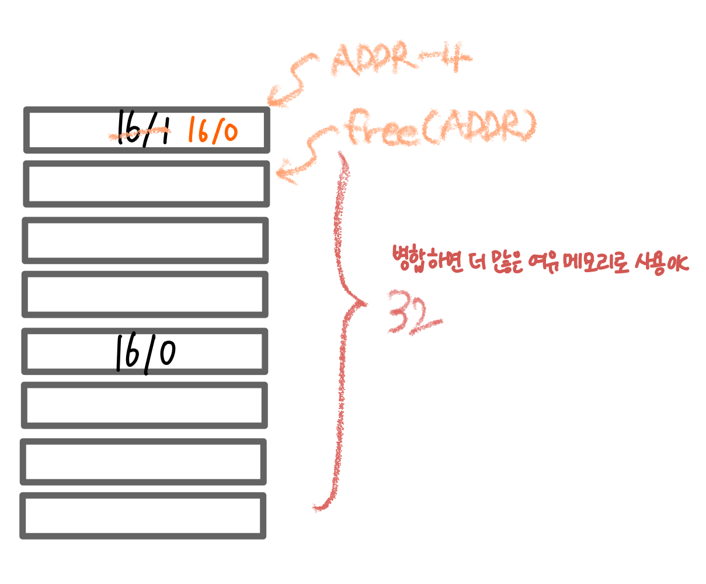
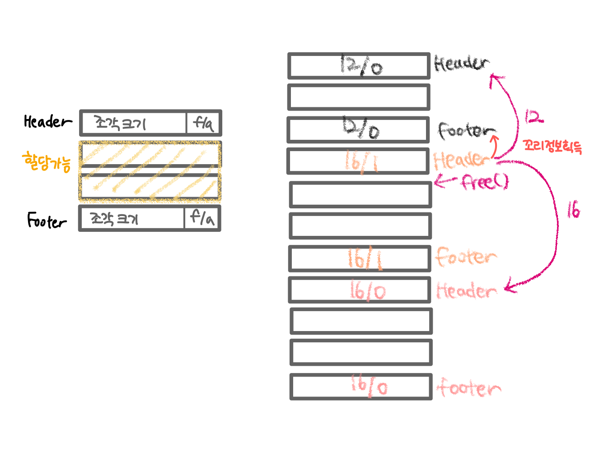

## 3.4 힙 영역: 메모리의 동적 할당은 어떻게 구현될까?

### Recap: Stack

- 함수 호출 > STACK FRAME (반환 주소, 지역 변수, 매개변수, 레지스터 정보)
- 함수 호출 단계 증가 > 스택 영역이 차지하는 메모리 증가 > 함수 호출 완료 > 스택 영역 메모리 무효화 > 스택 영역이 차지하는 메모리 감소
- 지역 변수의 수명주기는 함수 호출과 동일합니다 
  👍 **지역 변수의 장점**
  - 메모리 할당과 반환 문제에 신경 쓸 필요가 없습니다
    👎 **지역 변수의 단점**
  - 함수가 반환된 후 지역변수가 저장된 메모리가 유효하지 않아 함수를 뛰어넘어 사용할 수 없습니다.
  - 지역 변수는 프로그래머의 관리 대상이 아니라는 뜻입니다.
  - 내부 함수에서 외부 함수의 지역 변수를 사용하는 경우, 외부 함수의 스택 프레임이 유효하다는 상태임을 확인한다면 사용 가능합니다.
  - 함수를 뛰어 넘어 사용할 수 없으면, 1) **전역변수**를 사용하거나 2) **동적 메모리 할당으로 해결** 가능합니다.

### 3.4.1 힙 영역이 필요한 이유

함수를 뛰어넘어 사용하기 위해 전역 변수를 사용하는 방법의 단점은 모든 모듈에 노출된다는 것입니다. 모든 모듈에 노출되지 않으면서, 특정 데이터를 여러 함수에 걸쳐 사용하고 싶다면 **동적 메모리 할당**이 필요합니다.
 
동적 메모리 할당은 프로그래머가 직접 관리하는 특정 메모리 영역에 저장해야 합니다.

- 프로그래머가 직접 관리 > 동적 메모리 할당과 해제

  - 메모리 영역을 언제 요청할지
  - 얼마나 많은 메모리 영역을 요청할지
  - 언제까지 유효하게 유지할지

- 특정 메모리 영역 > 힙 영역 (heap segment)

  - 프로그래머가 완전히 제어할 수 있는 매우 큰 메모리 영역

- C/C++에서의 할당과 해제
  - 할당: `malloc` `new`
  - 해제: `free` `delete`

### 3.4.2 malloc 메모리 할당자 직접 구현하기

힙 영역은 단순히 "프로그래머가 수명 주기를 결정할 수 있는 메모리 영역을 제공" 합니다. 
중요한 것은 메모리 할당과 해제가 어떻게 구현되었는가 입니다. 실행 파일 생성 시 linker가 C standard library를 자동으로 링크하고, 이 표준 라이브러리 내 malloc 메모리 할당자를 포함합니다. 즉, 이미 구현되어 있으므로 할당을 구현할 필요 없이 malloc 호출만으로 메모리 할당이 가능하다는 뜻입니다.

- ✅ 메모리 할당자가 신경써야 하는 것
  - 메모리 영역을 제공하기만 하면 되며 무엇을 저장할지 신경쓰지 않는다(정수, 부동 소수점 숫자, 연결리스트, 이진 트리 등 어떠한 구조의 데이터도 모두 저장 가능).
  - 힙 영역은 커다란 배열 형태로 메모리 할당자에게 데이터는 단순한 바이트의 연속에 지나지 않는다.
- ✅ 메모리 할당자가 해결해야 하는 두 가지 문제
  - malloc의 구현: 메모리 요청을 받은 경우, 힙 영역에서 가능한 메모리 영역을 찾아 요청자에게 반환이 필요합니다.
  - free의 구현: 메모리 영역 사용 완료 시, 힙 영역에 이 메모리 영역을 반환하는 방법을 구현합니다.

### 3.4.3 주차장에서 메모리 관리까지

요청하는 메모리의 크기는 일정하지 않습니다. 
따라서 아래의 두 가지 목표를 충족하는 것을 우선으로 메모리를 할당하기로 합니다. 

1. 요청된 크기를 만족하는 여유 메모리를 **최대한 빨리** 찾는다.
2. 사용률 극대화를 위해 정해진 메모리 한도 내 **가능한 한 많은 메모리 할당 요청을 만족**시킨다.

> 🤔 그런데, 메모리가 할당되었는지 혹은 여유 메모리인지 어떻게 알 수 있을까요?

### 3.4.4 여유 메모리 조각 관리하기

- 어떤 메모리가 사용 가능한지 어떤 영역이 이미 할당 메모리인지 구분하여야 합니다.
- 이는 연결리스트로 비교적 간단히 구현이 가능합니다.
- 다만 malloc을 사용할 수 없다는 걸 유의하세요. malloc을 사용하는 것은 자가당착에 빠지는 것과 같으니까요!
- 연결리스트와 메모리 사용 정보(할당 또는 해제된 전체 메모리 정보)를 메모리 조각에 기록합니다.
- 기록되어야 하는 정보는 아래 두 가지 입니다.
  - 해당 메모리 조각이 비어 있는지 알려주는 설정값(flag)
  - 해당 메모리 조각의 크기를 기록한 숫자
- 최대한 간단한 구현을 위해 (1)**메모리정렬**이 필요 없고 (2)단일 메모리 할당에 허용되는 크기는 **최대 2GB**라 가정합니다.

> **NOTE**  
> 메모리 정렬이란?  
> CPU가 데이터를 최대한 효율적으로 접근할 수 있도록 특정 주소를 기준으로 데이터를 배치하는 방식입니다.

 

> **2GB?**  
> 2GB = 2 \* 10^9  
> 2^31 = 2,147,483,648  
> 메모리 크기를 0 ~ 2^31 - 1 (31bit)로 표현합니다. 
> 할당되었는지(allocated) 비어있는지(free)를 flag(1bit)로 표현합니다. 
> 총 32bit를 사용합니다.

 

### 3.4.5 메모리 할당 상태 추적하기

힙 영역을 키우면 아래처럼 표기 되어있을겁니다.

머리 정보에는 할당된 메모리 조각의 크기와 마지막 조각 4바이트를 이용해 특수한 표시(sentinel)로 끝(tail node)을 알려주는 표기를 합니다.

### 3.4.6 어떻게 여유 메모리 조각을 선택할 것인가: 할당 전략

- 메모리 할당자는 **적절한 크기**의 여유 메모리 조각을 찾아야 합니다.
- 만약 크기를 만족하는 여유 메모리 조각이 여러 개인 경우, 어떤 것을 반환 해야 할까요?
- 이는 **"할당 전략의 문제"** 입니다.

#### 1) 최초 적합 방식(first-fit)

- 처음부터 탐색하여 가장 먼저 발견된 요구사항을 만족하는 항목을 반환합니다.
- 단순합니다.
- 항상 제일 처음부터 사용 가능한 메모리 조각을 찾게 되므로 할당 과정 중 앞부분에 작은 메모리 조각이 많이 남을 가능성이 높습니다.
- 다음 메모리를 할당할 때에 더 많은 여유 메모리 조각을 탐색해야 합니다.

#### 2) 다음 적합 방식(next-fit)

- 도널드 커누드(Donald Knuth)가 제안한 방식입니다.
- 최초 적합 방식과 매우 유사합니다.
- 메모리를 요청할 때 처음부터 검색하는 대신 적합한 여유 메모리 조각이 마지막으로 발견된 위치에서 시작합니다.
- 최초 적합 방식보다 더 빠르게 여유 메모리 조각을 탐색합니다.
- 다음 적합 방식의 메모리 사용률이 최초 적합 방식에 미치지 못한다는 것이 연구 결과로 밝혀졌습니다.

#### 3) 최적 적합 방식(best fit)

- 요구 사항을 충족하는 첫 번째 여유 메모리 조각을 즉시 반환하는 최초 적합 방식, 다음 적합 방식과는 다르게 사용 가능한 메모리 조각을 모두 찾습니다.
- 그 중 요구 사항을 만족하면서도 크기가 가장 작은 조각을 반환합니다.
- 다른 방식보다 메모리를 더 잘 활용할 수 있습니다.
- 메모리 할당 시 사용가능한 모든 메모리 조각을 탐색해야 하므로 최초 적합 방식이나 다음 적합 방식 만큼 빠르지는 않습니다.

### 3.4.7 메모리 할당하기

- 우리는 최적 적합 방식으로 메모리를 찾았다고 가정하겠습니다.
- 이제는 메모리를 **할당**할 차례입니다.
- 16/0 으로 표기된 메모리에서 4바이트는 헤더의 크기입니다.
- 발견된 12바이트의 메모리 조각을 사용할 수 있습니다.
- 이 조각을 할당된 것으로 표시하고, 머리 정보 뒤에 따라오는 메모리 조각의 주소를 요청자에게 반환해주면 됩니다.
- ⚠️ 헤더 정보를 담고 있는 메모리는 요청자에게 반환해서는 안 됩니다. 헤더 정보가 손상되면 메모리 할당자가 정상적으로 동작할 수 없기 때문입니다.
   
   
  메모리를 아래와 같이 할당했습니다.
   
   
  
   
   
  이렇게 할당 '처리'된 메모리 중 사용하지 못하는 메모리를 내부 단편화 문제라 부르며 이를 사용할 수 없는 방법이 없습니다. 따라서 이 문제를 해결하기 위해 아래와 같이 여유 메모리 조각을 두 개로 분할하여 앞부분은 할당 후 반환하고, 뒷 부분은 조금 더 작은 여유 메모리 조각으로 만들어 버립니다.

여유 메모리 조각의 크기를 32바이트에서 16바이트로 변경해야 하는데, 이 중 머리 정보를 제외한 12바이트가 할당됩니다. 앞의 메모리 조각은 16/1로 16바이트를 할당한 상태로 표기, 뒤의 메모리 조각은 16/0로 여유 메모리 조각으로 표기해야 합니다.

#### 3.4.8 메모리 해제하기

우리가 지금까지 만든 malloc 은 메모리 할당 요청을 처리하는 능력을 갖추게 되었습니다. 
이제 남은 과제는 **메모리를 해제하는 것**입니다. 

사용자가 메모리를 요청할 때 얻은 주소(ex.`ADDR`)를 해제할 때 `free`와 같은 해제 함수에 전달합니다. 즉 `free(ADDR)`이와 같이 호출하면 `free`함수가 매개변수인 `ADDR`로 전달된 주소에서 머리 정보 크기인 4 바이트 만큼을 빼는 것으로 해당 메모리 조각의 머리 정보를 얻을 수 있습니다. 
이 머리 정보에서 할당 설정값(flag)을 여유 메모리로 바꾸면 해제가 완료됩니다. 
메모리 해제 시 메모리 조각 크기까지 전달하지 않고 메모리 주소만 전달하는 이유가 바로 여기에 있습니다. 

메모리 해제 시 아래와 같은 유의사항이 있습니다. 

인접한 메모리가 비어있다면 더 큰 메모리 조각으로 병합할 수 있는데, 이때 바로 병합하는 것이 좋을까요? 혹은 요구 사항을 충족하는 여유 블록을 찾을 수 없을 때까지 병합을 연기하는 것이 좋을까요?  즉시 병합하는 방법은 간단합니다. 하지만 메모리가 해제될 때 마다 메모리 조각을 병합하는 것은 부담이 발생합니다. 특히 메모리를 병합하자마자 메모리 조각을 다시 분할하는 메모리 사용 패턴의 경우, 불필요한 작업을 많이 수행하게 됩니다. 
따라서 실제 메모리 할당자는 거의 대부분 여유 메모리 조각 병합을 연기하는 전략을 사용하고 있습니다.

### 3.4.9 여유 메모리 조각을 효율적으로 병합하기

해제되는 메모리 조각은 앞과 뒤가 모두 비어있습니다.

- 현재 위치에서 16바이트 아래로 이동하면 다음 메모리 조각이 비어있음을 간단히 알 수 있습니다.
- 하지만 우리는 이전 메모리 조각에 대한 정보를 모르기 때문에 앞의 메모리 조각이 비어있는지 쉽게 알 수 없습니다.
- 그렇다면 앞에 위치한 메모리 조각이 비어있는지는 어떻게 효율적으로 알 수 있을까요?
- 이는 꼬리정보(footer)를 추가함으로써 해결할 수 있습니다.
  
- 꼬리 정보 > 그 다음에 위치한 조각의 머리정보와 인접
- 현재 조각 정보 - 4바이트 === 꼬리 정보 획득
- 메모리 해제 시 인접한 여유 조각을 빠르게 병합할 수 있습니다.
- 머리 정보와 꼬리 정보를 이용해 일종의 암시적 양방향 리스트를 만듭니다.

이렇게 메모리 할당자 설계를 완료하였습니다. 
그렇다면 저수준 계층의 관점에서는 메모리 할당 시 어떤 일이 일어날까요?
 
