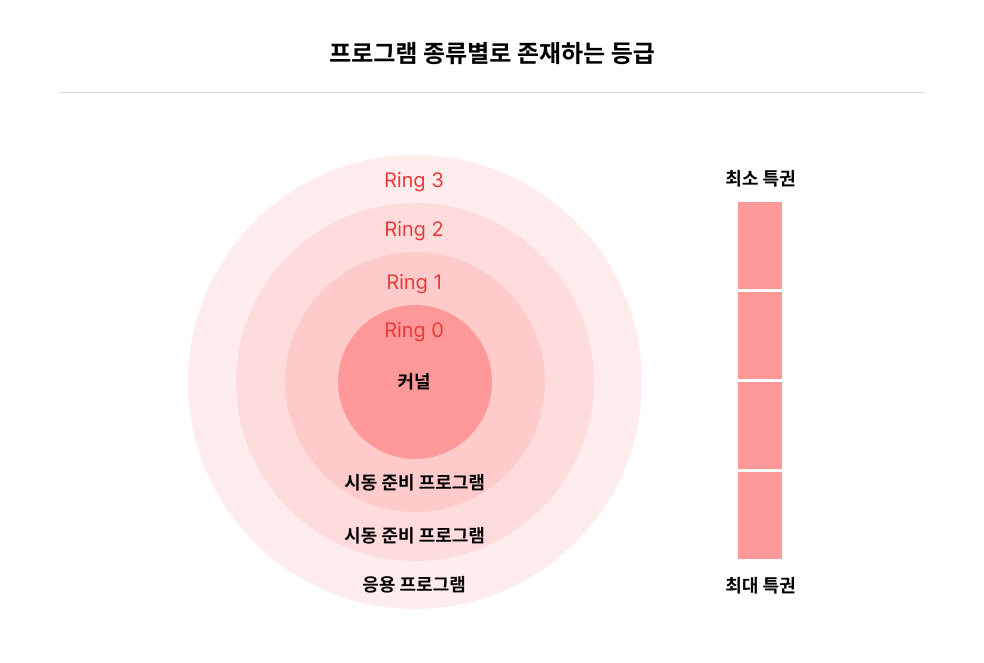
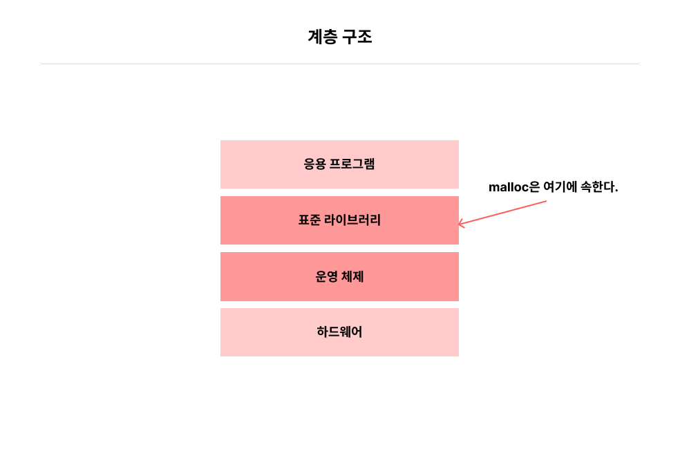
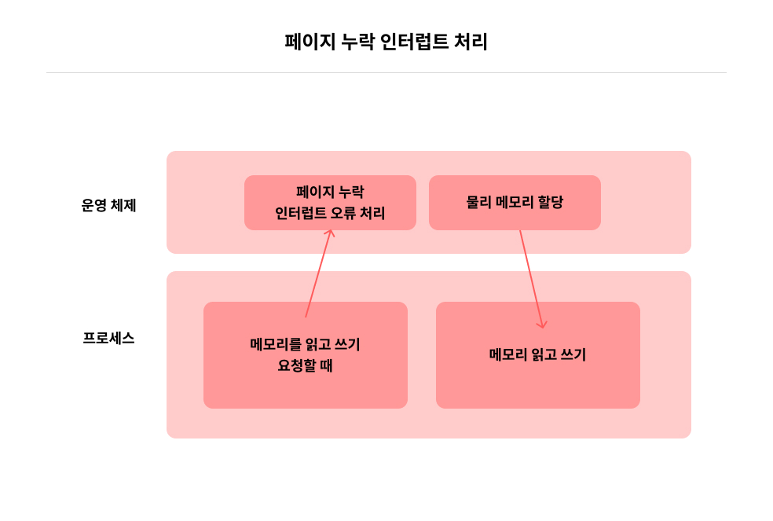

# 3.5 메모리를 할당할 때 저수준 계층에서 일어나는 일

메모리를 요청하면 저수준 계층에서 어떤 일이 일어날까?

 

## 1) 천지인과 CPU 실행 상태

코드는 여러 가지 등급으로 나뉘며, 프로그램이 실행되는 배경에는 몇 가지 단계가 존재한다.

### CPU는 "네 가지 특권 단계(privilege level)"을 제공한다!

- 0,1, 2, 3이라는 숫자는 실제로 CPU의 여러 가지 동작 상태를 나타낸다.
- 숫자가 작을수록 CPU의 특권(privilege)은 커진다.
- 특권 0단계일 때 특권이 가장 커지며, 모든 기계 명령어를 실행할 수 있다.
- 일반적으로 시스템은 CPU의 특권 단계 중 0, 3 두 단계만 사용한다.
- 3단계를 "사용자 상태(user mode)", 0단계를 "커널 상태(kernel mode)"라고 한다.

> **특권?** 일부 명령어를 실행할 수 있는지를 나타낸다. 일부 기계 명령어는 CPU가 가장 높은 특권 상태일 때만 실행 가능하다.

 
 

## 2) 커널 상태와 사용자 상태

CPU가 운영 체제 코드를 실행할 때 바로 **커널 상태**에 놓인다.

<u>커널 상태에서는</u> CPU가 모든 기계 명령어를 실행할 수 있고, 모든 주소 공간에 접근할 수 있다.   모든 주소 공간에 접근할 수 있으며, 제한 없이 하드웨어에 접근할 수 있다. (운영체제가 무엇이든 할 수 있는 상태)

### 프로그래머가 작성한 일반 코드는 어떤 상태일까?

프로그래머가 작성한 일반적인 코드를 CPU가 실행할 때는 사용자 상태에 해당한다.  사용자 상태 코드는 여러 곳에서 제한을 받고 특정 주소 공간은 절대 접근할 수 없다.

> 이런 제한이 없을 경우 운영 체제를 직접 죽이는 세그먼테이션 오류(segmentation fault)가 날 수 있다! 또 특권 명령어를 사용자 상태에는 실행할 수 없다는 제한도 있다.

 
 

## 3) 포털: 시스템 호출

CPU는 커널 상태에서는 응용 프로그램을 실행할 수 없는 반면, 사용자 상태에서는 운영 체제의 코드를 실행할 수 없다.

### 시스템 호출?

시스템 호출이라는 것을 이용해 운영 체제에 프로그래머는 서비스를 요청(데이터 송수신, 파일 읽기/쓰기 등)하면  운영 체제가 이런 서비스를 응용 프로그램 대신 처리해준다.

- 시스템 호출은 특정 기계 명령어로 구현된다.
- CPU는 사용자 상태 ➡️ 커널 상태로 전환해 운영 체제 코드를 실행해 사용자 요청을 수행한다.

> 이런 시스템 호출은 모두 별도의 장소에 담겨 있는데 왜 이렇게 별도의 장소에 담아 두었을까?

 
 

## 4) 표준 라이브러리: 시스템의 차이를 감춘다

우리는 사용자에게서 저수준 계층 간 차이를 감추는 일종의 표준이 필요하고,  이를 통해 프로그래머가 작성한 프로그램을 수정 없이 서로 다른 운영 체제에서 실행할 수 있다.

C언어에서 이 일을 하는 것이 "표준 라이브러리(standard library)"이다. 표준 라이브러리는 사용자 상태에서도 실행된다.

- 고수준 계층에는 응용 프로그램이 자리한다.
- 응용 프로그램은 일반적으로 표준 라이브러리만 의사소통 대상으로 간주한다.
- 표준 라이브러리는 시스템 호출로 운영 체제와 소통한다.
- 운영 체제는 저수준 하드웨어를 관리한다.
- malloc은 표준 라이브러리 계층에 속한다.

> 메모리 할당자는 각자 접합한 활용 방식이 있기 때문에, 특정 상황에 가장 적합한 메로리 할당자를 선택하는 것이 중요하다.

 
 

## 5) 힙 영역의 메모리가 부족할 때

### 메모리 할당자 안의 여유 메모리 조각이 부족하면 어떻게 할까?

힙 영여과 스택 영역 사이의 여유 공간에 힙 영역 메모리가 부족하면 위쪽으로 더 많은 메모리를 점유하게 된다.

malloc가 메모리가 부족해지면 운영 체제에 메모리를 요청하기 위해 리눅스 내 모든 프로세스에서는 힙 영역의 최상단을 가리키는 **brk 변수(break)** 라는 변수 값을 위로 이동시키는데 이를 위해 **시스템 호출**이 필요하다.

 
 

## 6) 운영 체제에 메모리 요청하기:brk

시스템 호출이 있기 때문에 힙 영역이 부족하면 즉시 운영 체제에 늘릴 것을 요청해 더 많은 여유 메모리를 확보할 수 있다.

### 구체적인 메모리 할당 단계를 알아보자!

1. 프로그램은 malloc를 호출해 메모리 할당을 요청한다.(malloc : 표준 라이브러리 내 구현)
2. malloc는 여유 메모리 조각을 검색한다.
3. 적절한 크기 조각을 찾으면 할당한다. (사용자 상태)
4. 여유 공간을 찾지 못하면, brk 시스템 호출 등으로 운영 체제에 힙 영역을 늘려달라고 요청한다. (커널 상태)
5. 힙 영역이 늘어나면 malloc가 다시 한번 적절한 메모리 조각을 찾아 할당한다.

 
 

## 7) 빙산의 아래: 가상 메모리가 최종 보스다

가상 메모리를 지원하는 시스템에서는 위와 같은 과정은 일어나지 않는다.

malloc의 호출이 반환되면 프로그래머가 받아 오는 메모리는 가상 메모리이다.(실제 물리 메모리가 전혀 할당되지 않은 상태일 수 있다)

### 실제 메모리는 언제 할당할까?

실제 할당된 메모리가 사용되는 순간 물리 메모리를 할당한다. 이때 가상 메모리가 아직 실제 물리 메모리와 연결되어 있지 않으면 내부적으로 **페이지 누락 오류(page fault)** 가 발생할 수 있다.

### 페이지 누락 오류를 운영 체제는 어떻게 처리할까?

운영 체제가 감지하면 페이지 테이블을 수정해 가상 메모리와 실제 물리 메모리의 사상 관계를 설정해 실제 메모리가 할당된다.

해당 과정이 완료될 때 프로그램에서 할당받은 메모리를 사용할 수 있다.

 
 

## 8) 메모리 할당의 전체 이야기

### malloc를 호출해 메모리를 요청하면 어떤 일이 일어날까?

1. malloc는 여유 메모리 조각을 검색하고 적절한 크기를 찾으면 할당한다.
2. 찾지 못하면 brk같은 시스템 호출로 힙 영역을 확장해 여유 메모리를 얻는다.
3. brk 호출 시 커널 상태로 전환되고, 운영 체제의 가상 메모리 시스템이 힙 영역을 확장한다. (이때 메모리는 가상 메모리, 실제 물리 메모리 할당이 아닐 수 있다.)
4. brk 실행 종료 후 malloc로 제어건이 돌아가 CPU는 사용자 상태로 전환된다.
5. malloc는 적절한 여유 메모리 조각을 찾아 반환한다.
6. 이후 코드가 새로 요청된 메모리를 읽거나 쓰면 시스템 내에서 페이지 누락 인터럽트(page fault interrupt)가 발생한다.
7. CPU는 커널 상태로 전환되고 운영 체제가 실제 물리 메모리를 할당한다.

> 이때, 페이지 테이블 내 가상 메모리와 실제 물리 메모리의 사상 관계가 설정된 후 CPU는 다시 커널 상태에서 사용자 상태로 돌아가 다음 처리로 넘어간다.

### 사상 관계?

**사상(mapping)** 은 두 개의 서로 다른 개념을 연결하는 과정이다.  운영체제에서 메모리를 다룰 때, 가상 메모리와 물리 메모리를 연결하는 과정이 필요한데 이걸 바로 사상 관계라고 한다.

가상 메모리 주소와 실제 물리 메모리 주소를 연결하는 관계로  운영체제는 페이지 테이블을 사용해 이 관계를 관리한다.

### 이 과정에서 malloc 한 줄이 어떤 영향을 미칠까?

단 한 줄의 코드지만 malloc를 통해 빈번하게 메모리를 할당하고 해제하는 것은 시스템 성능에 영향을 미치고 비교적 높은 성능이 필요한 시스템에서는 그 차이가 더 벌어진다.

malloc외에도 **메모리 풀(memory pool)** 이라는 기술이 해답이 되어줄 수 있다.
