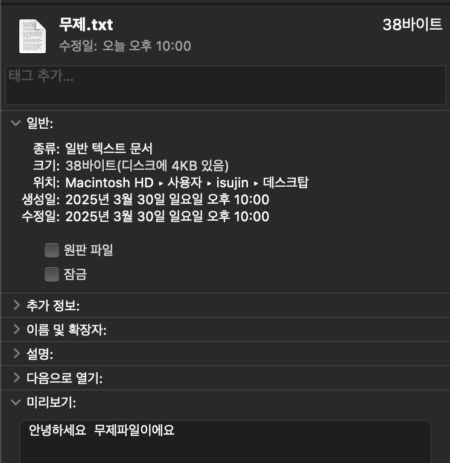

## 3.8 왜 SSD는 메모리로 사용할 수 없을까?

SSD(Solid State Drive)는 비 휘발성 메모리 장치(Non-volatile Memory, NVM)로 전원이 꺼져도 저장된 데이터를 유지하는 플래시 메모리 저장장치입니다.<br>
이와 비교할 만한 것이 HDD(Hard Disk Drive)인데요, 이는 내부에 회전하는 디스크가 있고, 그 위에 정보를 기록하고 읽습니다.<br>
둘 다 비휘발성 스토리지이지만, 내부 구현은 완전히 다른 셈입니다.<br>

- SSD의 장점

  - HDD보다 읽고 쓰는 속도가 빠름
  - 뛰어난 내구성으로 HDD에 비해 파손이 적음
  - 내부에 모터가 없어 소비 전력이 낮음

- HDD
  - SSD보다 대용량이고, 가격이 쌈
  - 데이터 휘발성이 낮아 안정적임

현재 기준 성능이 좋다고 평가받는 SSD의 스펙은 순차 읽기 속도가 최대 7.5GB/s라 합니다.<br>
그렇게 읽기 속도가 빠르다면 메모리처럼 사용할 수 있지 않을까요?<br>

하지만 우리가 사용하는 메모리(RAM, 휘발성 메모리)는 훨씬 더 빠릅니다. 현재 DDR 메모리의 최대 대역폭은 60GB/s를 넘습니다.<br>
이를 SSD로 대체한다면 컴퓨터 속도는 지금의 10분의 1수준으로 줄어들 것입니다.<br>
이를 실제 데이터 읽기와 쓰기 관점에서 바라보겠습니다.

### 3.8.1 메모리 읽기/쓰기와 디스크 읽기/쓰기의 차이

터미널의 Desktop에서 아래를 실행해봅니다.

```
      ~ % cd Desktop
Desktop % echo "안녕하세요 무제파일이에요" > 무제.txt
```

그리고 파일 정보를 가져와보겠습니다.



크기는 38 byte, 디스크에는 4 kB를 차지하고 있습니다.<br>
파일 크기에 비해 디스크 공간을 차지하는 크기가 큰 것 같죠?<br>

CPU는 메모리 주소를 이용하여 해당 내용에 접근가능하며, 메모리 주소 지정단위는 바이트(byte)입니다.<br>
하지만 SSD는 그렇지 않다는 걸 확인할 수 있습니다.<br>
이보다 큰 단위(조각 단위)로 데이터를 관리하고 조각 크기가 다양하며,<br>
이 때 CPU는 파일의 특정 바이트에 직접 접근할 수 없습니다.<br>
SSD는 바이트 단위 주소 지정이 지원되지 않는다는 것입니다.<br>
<br>
따라서 CPU는 SSD에 저장된 데이터에 직접 접근하는 것이 불가능하고(파일 읽기/쓰기 불가능)<br>
CPU는 SSD 또는 디스크에서 직접 프로그램을 실행할 수 없습니다.<br>
즉 시스템 호출을 사용해야 합니다.<br>

### 3.8.2 가상 메모리의 제한

최신 운영 체제의 메모리 관리는 기본적으로 가상 메모리 기반입니다.<br>
32비트 시스템의 최대 주소 지정범위는 4GB에 불과 하므로, 1TB 크기를 가진 SSD 메모리를 사용한대도<br>
프로세스는 여전히 4GB 이상의 메모리를 사용할 수 없습니다.<br>

최신 운영 체제의 메모리 관리 방식(가상 메모리)을 고려하면 SSD는 메모리로 사용할 수가 없는 것이죠.<br>
주소 지정 범위가 충분히 큰 64비트 시스템에서는 이런 문제가 없습니다.<br>

### 3.8.3 SSD 사용 수명 문제

SSD 제조 원리에 따라 SSD 저장 장치에는 사용 수명 제한이 있습니다.<br>
이들에게는 기록 가능한 최대 바이트를 TB단위로 표기하는 TBW(TeraBytes Written)단위를 갖고 있습니다.<br>
보통 SSD의 TBW는 수백TB 수준이며, 이는 SSD에 기록한 데이터가 수백 TB에 달하면 문제가 생긴다는 말과 같습니다.<br>

CPU는 프로그램을 실행할 때 대량의 메모리 읽기/쓰기 작업을 실행하므로 SSD를 메모리로 사용한다면,<br>
사용 수명때문에 시스템에 병목 현상이 발생할 수 있습니다.<br>

현 시점의 저장 장치 제조 기술의 한계로 SSD를 메모리로 직접 사용할 수 있는 방법은 없습니다.<br>

