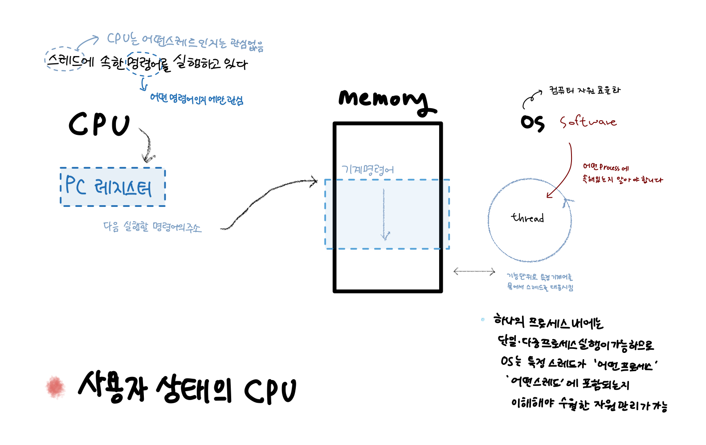
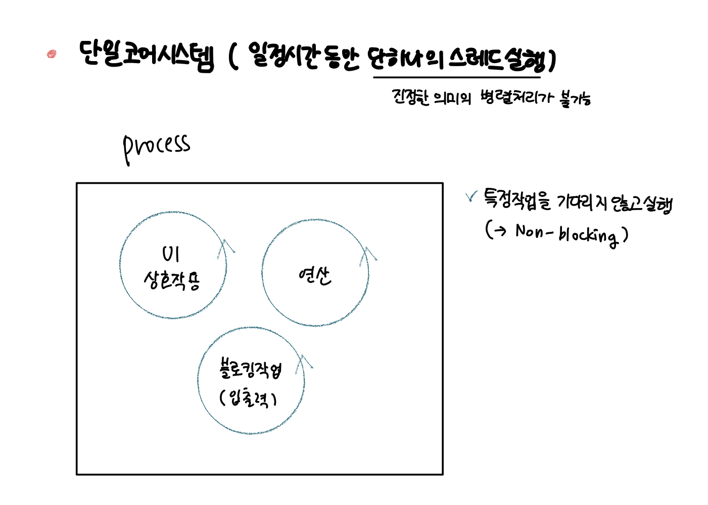

## 4.5 CPU 코어 수와 스레드 수 사이의 관계는 무엇일까?

### 4.5.1 레시피와 코드, 볶음요리와 스레드

- CPU가 사용자 상태인 경우, CPU가 실행하는 기계 명령어는 스레드에 속해 있습니다.
- CPU는 어떤 스레드에 속한 기계 명령어인지 관심 없습니다. 이를 이해해야 하는 것은 운영체제(OS)입니다.
- CPU는 그저 기계 명렁어를 실행할 뿐 입니다.
- CPU의 **각 코어는 동시에 하나의 스레드**만 실행할 수 있습니다. 운영 체제는 여러 프로세스를 코어에 번갈아 가며 배정합니다.
- 이 때 하나의 프로세스는 싱글 스레드 또는 멀티 스레드로 구성됩니다.
- 메모리가 충분하고 운영체제에 제한이 없다면 단일 코어에서도 많은 스레드를 생성할 수 있습니다.

 

  

 

### 4.5.2 작업 분할과 블로킹 입출력

- 단일 코어 시스템에서 일정 시간 동안 단 하나의 스레드만 실행할 수 있습니다.
- 여러 개의 스레드가 번갈아가며 실행할 수 있으나 진정한 병렬 처리는 아닙니다.
- 작업 하나를 여러개로 분할하고, 이 하위작업들을 별도의 스레드에 배치하여 운영체제가 스케줄링하고 실행할 수 있도록 합니다.

 

  

- 블로킹 입출력과 같은 작업이 필요한 경우 운영체제가 전체 스레드를 일시중지 합니다.
- 블로킹 입출력 코드를 별도의 스레드에서 실행하면 나머지 코드는 영향받지 않고 계속 실행됩니다.
- 특정 작업을 기다리지 않고 실행하는 것을 논블로킹(Non-blocking)이라 합니다.

> Non-blocking I/O는 입출력 작업이 완료될 때까지 기다리지 않고,  
> 즉시 제어를 반환하여 다른 작업을 수행할 수 있도록 하는 방식입니다.  
> 이러한 방식은 입출력 작업을 별도의 스레드나 이벤트 루프를 통해 처리하며, 운영체제의 스케줄링에 따라 실행됩니다.  

 

### 4.5.3 다중 코어와 다중 스레드

- 단일 코어 성능을 끌어올리기 어려워지자, 다중 코어를 생산하기 시작했습니다.
- 이러한 다중 프로세스 프로그래밍은 프로세스 간 통신 방식 및 프로세스 간 전환에 드는 비용과 같은 문제가 있습니다.
- 스레드는 다중 프로세스 프로그래밍에 대한 해결책이 되어, 다중 코어 리소스를 최대한 활용하기 위한 도구로 사용됩니다.
- 스레드 수가 한계에 달하면 스레드 전환 부담이 증가하므로 성능이 떨어지기 시작 합니다.
- 시스템 코어 수와 생성되는 스레드 수가 일정한 선형 관계를 유지하는 것이 가장 좋습니다.
