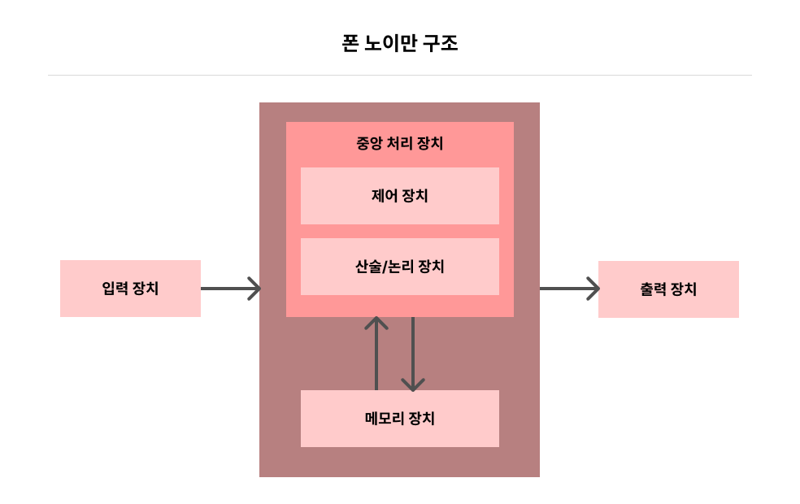

# CPU 진화론(상): 복잡 명령어 집합의 탄생

## 1) 프로그래머의 눈에 보이는 CPU

우리가 작성하는 모든 프로그램은 복잡도와는 관계없이 결국 컴파일러로 하나하나 간단한 기계 명령어를 변환한다.  
그렇기에 본질적으로 CPU입장에서는 프로그램에 따른 차이가 없고, CPU가 읽을 명령어는 실행 파일에 저장되며, 프로그램이 실행되면 메모리에 적재된다.

CPU는 단순하게 메모리에서 명령어를 읽어 실행하기만 하면 된다.

 
 

## 2) CPU의 능력 범위: 명령어 집합

CPU도 유형에 따라 사람의 능력 범위와 같은 고유한 능력 범위를 가지고 있다.  
명령어 집합(instruction set architecture)이 그것인데 명령어 집합에는 여러 가지 명령어가 포함되어 있다.

### 명령어 집합의 역할?

명령어 집합은 우리에게 CPU가 할 수 있는 일을 알려준다.
명령어 집합에서 명령어를 하나 찾아 CPU로 보내면 CPU는 해당 명령어가 지시하는 작업을 실행한다.

### 명령어 집합은 어디에 사용될까?

프로그래머가 프로그래밍에 사용한다.   최초의 프로그램은 CPU에 대응하는 어셈블리어로 직접 작성되었고, 이 시기의 코드는 소박했다.

첫 번째 명령어 집합 유형이자 처음으로 탄생했던 명령어 집합인 복잡 명령어 집합 컴퓨터를 살펴보자.

x86 구조는 복합 명령어 집합에 기초를 두고 있고, 이런 x86 프로세서를 생산하는 제조업체는 우리에게 친숙한 인텔과 AMD이다.

 
 

## 3) 추상화: 적을수록 좋다

이전 시기 대부분 프로그램은 직접 어셈블리어로 작성되었기 때문에 일반적으로 명령어 집합이 더욱더 풍부해야 하며 명령어 자체 기능도 더 강력해야 한다고 여겼다.

그래서 이 시기 컴퓨터 과학자들이 말하는 의미상 간격(semantic gap)을 이어 주는 것에 해당한다.

### 의미상 간격은 무엇일까?

당시에는 함수 호출, 순환 제어, 복잡한 주소 지정 패턴, 데이터 구조, 배열 접근 등 고급 언어의 개념과 이에 직접 대응하는 기계 명령어가 있어야 한다고 생각했다. (간격을 줄여 더 많은 작업을 할 수 있기 때문)

 
 

## 4) 코드도 저장 공간을 차지한다

오늘날의 컴퓨터는 기본적으로 폰 노이만 구조를 따른다. 이 구조의 핵심 사상은 "저장 개념에서 프로그램과 프로그램이 사용하는 데이터에 어떤 차이도 없어야 하며, 모두 컴퓨터의 저장 장치 안에 저장될 수 있어야 한다"는 것이다.

폰 노이만 구조에서 실행 파일은 기계 명령어와 데이터를 모두 포함하고 있다는 것을 알 수 있다.

프로그래머가 작성한 코드는 디스크 저장 공간을 차지하며 실행 시에는 메모리에 적재되므로 메모리 저장 공간을 차지하는 것을 알 수 있다.

이후, 인텔 1103 메모리 칩의 출시로 컴퓨터 업계에 동적 램(DRAM) 시대의 서막을 알렸으며 동적 램이 바로 우리에게 익숙한 메모리이다.

이 작은 메모리에 더 많은 프로그램을 적재하려면 기계 명령어를 반드시 매우 세밀하게 설계해서 프로그램이 차지하는 저장 공간을 줄여야 했다.

 
 

## 5) 필연적인 복잡 명령어 집합의 탄생

명령어를 사용한 편리한 프로그램을 작성하고 코드의 저장 공간을 절약해야 했기에 복잡 명령어 집합을 설계해야 하는 필요성이 대두되어 복잡 명령어 집합이 탄생되었다.

### 복잡 명령어 집합의 문제는 없었을까?

이 시기 CPU 명령어 집합은 모두 직접 연결 방식이었다. 즉, 명령어 해독, 실행 등 각 단계가 특정 조합 회로로 직접 제어된다.

해당 방법의 유연성이 몹시 떨어져 명령어 집합의 변경에 대응하기 어려웠다.

> 대부분의 명령어에 포함된 연산을 더 간단한 명령어로 구성된 작은 프로그램으로 정의하고 이를 CPU에 저장하면 모든 기계 명령어에 대응하여 전용 하드웨어 회로를 설계할 필요가 없다.

즉, 소프트웨어가 하드웨어를 대체하게 되는데 여기서 사용되는 더 간단한 명령어가 바로 마이크로코드이다.

더 많은 명령어를 추가할 때, 주요 작업은 마이크로코드 수정에 집중되며 하드웨어 수정은 거의 필요하지 않기에 CPU 설계 복잡도를 낮출 수 있다.

 
 

## 6) 마이크로코드 설계의 문제점

마이크로코드의 버그를 수정하는 것은 일반 프로그램의 버그를 수정하는 것보다 훨씬 더 어려울 뿐만 아니라, 트랜지스터를 매우 많이 소모한다는 사실이 드러났다.

컴퓨터 과학자인 데이비드 패터슨은 마이크로코드 설계를 개선하는 과제를 맡았고 마이크로코드보다 더 나은 설계가 있는 지 고민하기 시작했다.
