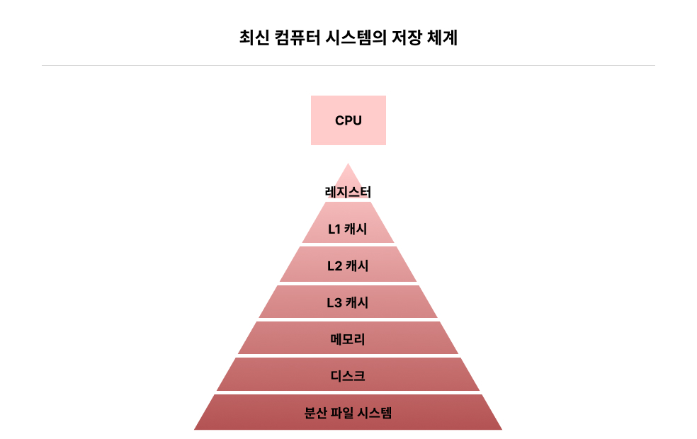

# 캐시, 어디에나 존재하는 것

폰 노이만 구조로 알려진 이 모델에서는  
기계 명령어와 명령어에서 사용하는 데이터가 메모리에 저장되어 있어야 하며, 
CPU가 기계 명령어를 실행할 때 먼저 명령어를 메모리에서 읽어야 한다.

또, 명령어를 실행하는 과정에서 데이터를 메모리에서 읽어야 할 수도 있다. 
그뿐만 아니라 명령어가 계산 결과 저장을 포함할 때는 이를 다시 메모리에 저장해야 한다.

이런 CPU와 메모리 간 상호 작용 방식은 CPU의 설계와 제조, 컴퓨터 시스템의 성능, 
프로그래머의 프로그래밍에 지대한 영향을 미친다.

CPU는 반드시 빈번하게 메모리에 접근해 명령어와 데이터를 가져와야 하고, 
명령어의 실행 결과도 메모리에 다시 기록해야 한다.

이런 환경에서 CPU와 메모리의 속도가 서로 잘 맞는지 확인하는 것이 핵심이다.

 
 

## 1~2) CPU와 메모리의 속도 차이 / 도서관, 책상, 캐시

CPU는 항상 배고픈 존재고, 메모리는 매우 느릿느릿한 요리사에 비유할 수 있다. 
CPU는 항상 포만감을 느낄 수 없는데 항상 CPU는 메모리를 기다릴 수 밖에 없다.

도서관, 책상, 캐시에 비유해보자.

도서관에 가서 원하는 자료들을 찾는 상황에서 처음 자료를 찾으면 시간이 오래 걸리지만 
한 번 찾고 난 후에는 원하는 자료가 책상들에 있기 때문에 더이상 서가를 갈 필요가 없다.

이 때, 책상은 캐시 그리고 서가는 메모리에 비유할 수 있다. 
CPU와 메모리 사이의 속도 불일치 문제를 해결하는 것도 동일한 흐름으로 가능하다.

 

### 어떻게 속도 불일치 문제를 해결할 수 있을까?

최신 CPU는 메모리 사이에 캐시 계층이 추가되어 있다. 
캐시는 가격이 비싸고 용량이 제한적이지만 접근 속도가 거의 CPU 속도에 필적한다.

이런 캐시 안에 최근 메모리에서 얻은 데이터가 저장되며, 
CPU는 메모리에서 명령어와 데이터를 꺼내야할 때도 무조건 먼저 캐시에서 해당 내용을 찾는다.

> 해당 구조로 CPU는 직접 메모리를 읽고 쓰지 않기 때문에 CPU와 메모리 사이의 속도 차이를 보완할 수 있다.

 

### x86같은 최신 CPU에서는 어떨까?

최신 CPU와 메모리 사이에는 실제 세단계의 캐시가 추가되어 있는데, 
L1, L2, L3캐시로 구분된다.

각 캐시의 접근 속도는 L1 -> L3으로 갈 수록 접근 속도는 낮아지지만 용량은 증가한다. 
L1, L2, L3캐시와 CPU 코어는 레지스터 칩 내 묶여 패키징되어 있다.

 

### CPU가 메모리에 접근할 필요가 있을 때 어떻게 접근할까?

L1 캐시를 먼저 살펴보고 이후, L2, L3 캐시를 각각의 캐시에 적중하지 않을 때 순차적으로 살펴본다.
마지막까지 적중하지 않으면 그제서야 메모리에 접근해 캐시에 데이터를 갱신한다.

다음에 접근할 때 캐시가 적중하면 다시 메모리에 접근할 필요가 없다.

> 캐시는 컴퓨터 시스템 성능 향상에 매우 중요하므로 오늘날 CPU칩에서 상당 부분의 공간을 캐시가 차지하고 있고, 실제로 기계 명령어를 실행하는 CPU 코어가 차지하는 공간은 그리 크지 않다

 
 

## 3) 공짜 점심은 없다: 캐시 갱신

캐시 추가에 대한 대가는 메모리 기록할 때 나타난다.

캐시가 있기 때문에 CPU가 직접적으로 메모리에 일하지 않는데 이때 캐시의 데이터는 갱신되었지만 
메모리 데이터는 예전 것이 남아있는 불일치 문제가 있을 수 있다.

 

### 불일치 문제 해결 방법을 알아보자!

가장 간단한 방법은 캐시를 갱신할 때 메모리도 함께 갱신하는 **"연속 기입"** 방법이 있다. 
이 방식을 사용할 경우 CPU는 메모리가 갱신될 때까지 대기해야하는 동기식 설계 방법에 해당한다.

 

### 해당 방식을 최적화하려면?

CPU가 메모리에 기록할 때는 캐시를 직접 갱신하고, 
메모리 갱신 완료를 기다리지 않고, CPU가 계속 다음 명령어를 실행할 수 있게 
비동기식 설계 방식을 활용하면 된다.

 

### 이때 캐시의 최신 데이터는 언제 메모리에 갱신될까?

캐시 용량에 한계가 있어 용량이 부족할 경우 반드시 자주 사용되지 않은 데이터를 제거해야 하는데 
캐시에서 제거된 데이터가 수정된 적이 있으면 이를 메모리에 갱신해야 한다.

캐시 갱신과 메모리의 갱신이 분리되므로 해당 방식은 비동기이며, 이를 **후기입 방법**이라 한다.

 
 

## 4) 세상에 공짜 저녁은 없다: 다중 코어 캐시의 일관성

다중 코어를 최대한 활용하는 다중 스레드 또는 다중 프로세스가 없다면 다중 코어의 위력을 충분히 활용할 수 없다. 
이처럼 CPU가 코어 여러 개를 가지고 있다면 또 다른 문제가 발생하는데

C1, C2라는 코어 2개가 있을 때 메모리에 X라는 변수가 있다고 하자.

두 CPU코어에서 메모리의 X변수를 사용해 캐시에 복사본 두 개를 가지고 있다면, 
C1이 캐시를 갱신할 때, C2 캐시의 X값은 동기적으로 수정되지 않는 불일치 문제가 생긴다.

 

### 해당 문제는 어떻게 해결할까?

캐시 한 개에서 갱신된 변수가 다른 CPU 코어의 캐시에도 존재한다면 이 캐시도 함께 갱신되어야 한다.

CPU는 변수를 업데이트할 때 단순히 자체 캐시와 메모리만 신경 쓰는 것이 아니라 
해당 변수가 다른 CPU 코어의 캐시에도 있는 지 확인하고 있다면 해당 캐시도 갱신해야 한다.

사실 최신 CPU는 고전적인 MESI 규칙 같은 다중 코어 캐시의 일관성을 유지하는 규칙이 있다.

> 캐시는 시스템 성능을 향상시키지만 동시에 또다른 복잡함을 더한다.

 
 

## 5) 메모리를 디스크의 캐시로 활용하기

프로그램이 파일 입출력을 할 때 디스크 관련 문제가 떠오른다.

디스크를 메모리와 비교할 때 메모리 접근 속도는 디스크 탐색 속도보다 10만 배 가량 빠르다. 
파일을 읽을 때는 먼저 데이터를 디스크 -> 메모리로 옮겨야 CPU가 메모리에서 파일의 데이터를 읽을 수 있다.

 

### 어떻게 메모리와 디스크의 속도 차이를 해결할까?

레지스터는 메모리의 캐시가 될 수 없는데 레지스터의 크기가 한정되어 있기 때문이다. 
메모리는 용량이 큰데 그래서 최신 운영 체제는 분명이 메모리를 디스크의 캐시로 사용한다.

> 디스크의 접근 속도가 매우 느리기 때문에 메모리에 있는 데이터를 디스크의 캐시로 사용한다.  이렇게 할 경우 다음에 파일에 접근할 때는 디스크를 이용한 입출력 과정을  거칠 필요 없이 직접 메모리에서 가져오기만 하면 된다.

 

매번 파일을 읽을 때마다 디스크 입출력이 발생하지는 않는다.
컴퓨터를 사용하다 보면 큰 파일을 처음 적재할 때는 오래 걸리지만 두 번째에는 빠르게 적재된다.

이는 해당 파일 내용이 이미 메모리에 보관되어 있어 캐시가 적중할 경우 디스크 접근이 필요하지 않기 때문에
파일 적재 속도가 크게 빨라지는 것이다.

> 컴퓨터 저장 시스템에서는 CPU의 내부 캐시가 메모리 데이터를 저장하고, 
> 메모리가 디스크 데이터를 저장한다는 것을 알 수 있다.

일부 상황에서는 데이터베이스를 전부 메모리에 직접 설치하여 디스크 입출력이 필요하지 않을 수 있지만, 
메모리는 디스크를 완전히 대체할 수 없는데 
메모리는 데이터를 영구적으로 저장할 수 있는 기능이 없기 때문이다.

메모리를 디스크의 캐시로 취급하여 파일 접근 속도를 크게 향상시키고 디스크 입출력을 줄일 수 있게 되었다. 
하지만 파일을 읽고 쓸 때 메모리가 디스크의 캐시 역할만 하는 것은 아니며, 
메모리 자신을 읽고 쓸 때도 마찬가지다.

 
 

## 6) 가상 메모리와 디스크

파일을 읽고 쓸 때 메모리를 디스크 캐시로 쓸 수 있는데 이때 디스크는 메모리의 "창고" 역할을 할 수 있다. 
일부 프로세스에서 자주 사용하지 않은 메모리 데이터를 디스크로 기록하고 
이 데이터가 차지하던 물리 메모리 공간을 해제 한다.

그럼 추가로 프로세스가 다시 메모리를 요청할 수 있다.

> 디스크가 메모리의 일부 작업을 넘겨받기에 더 이상 물리 메모리에 국한되지 않는데  이 모든 일을 운영 체제가 하고 있기 때문이다.

 
 

## 7) CPU는 어떻게 메모리를 읽을까?

운영 체제가 가상 메모리를 사용한다고 가정해보자.

CPU가 메모리를 사용할 때 실행하는 읽기와 쓰기 명령어가 사용하는 것도 가상 메모리 주소이며, 
이 주소는 실제 물리 메모리 주소로 변환되어야 한다. 변환 후에는 캐시를 검색하기 시작한다.

여기서 주의할 점은 가상 메모리의 존재로 프로세스의 데이터는 디스크에 임시로 보관될 수 있다는 것이다.

> 이 때는 해당 데이터를 메모리에서도 찾을 수 없을 가능성이 있어, 
> 디스크의 프로세스 데이터를 메모리에 다시 적재한 후 메모리에 읽어야 한다.

 
 

## 8) 분산 저장 지원

단일 장치의 디스크만으로는 방대한 사용자 데이터를 완전히 저장할 수 없다. 
이런 대용량 데이터의 저장 문제를 해결하려면 분산 파일 시스템을 활용하면 된다.

사용자 장치는 분산 파일 시스템을 직접 장착할 수 있고, 
로컬 디스크는 원격의 분산 파일 시스템에서 전송된 파일을 저장한다.

네트워크를 통하지 않고 로컬 디스크에 직접 접근하므로 
로컬 디스크를 원격의 분산 파일 시스템의 캐시로 간주할 수 있다.

또, 응답 속도를 더 높이기 위해 원격 분산 파일 시스템의 데이터를 
데이터 흐름 형태로 직접 로컬 컴퓨터 시스템의 메모리로 끌어올 수 있다.

> 이렇게 컴퓨터 저장 체계의 각 계층이 다음 계층에 대한 캐시 역할을 하고, 
> 각 계층의 저장 용량은 반드시 다음 계층보다 작아야 한다.  

> 이에 근거하여 전체 저장 체계가 최대 성능을 발휘하려면 
> 프로그램이 매우 캐시 친화적이어야 한다.

 
 
